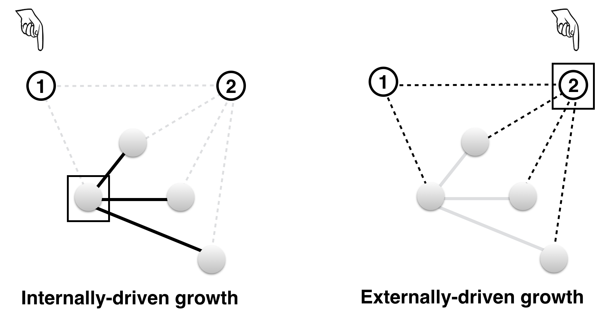

```{r}
knitr::opts_chunk$set(echo=F, warning=F, cache=F, message=F, sanitize = T)
```


```{r load_packages, include = FALSE}
library(papaja)
library(readr)
library(tidyr)
library(ggplot2)
library(cowplot)
library(ggpubr)
library(knitr)
library(boot)
library(dplyr)
library(gridExtra)
#library(langcog)
library(ggthemes)
library(broom)
library(HDInterval)
library(kableExtra)
#library("knitcitations")
#cleanbib()
#options("citation_format" = "pandoc")
```

# Introduction

What factors shape vocabulary learning over the course of early childhood? To investigate this question, scientists have adopted multiple research strategies, from conducting controlled laboratory experiments [e.g. @markman90] to analyzing dense corpora capturing language learning in context [e.g., @roy2015]. One prominent strategy consists in documenting the timeline of words' acquisition and studying the properties that make words easy or hard to learn [e.g., @goodman2008; @huttenlocher1991]. For example, @goodman2008 found that, within a lexical category (e.g., nouns), higher parental frequency is associated with earlier learning. Researchers have studied the role of several other factors such as word length and the mean length of utterances in which the word occurs [e.g., @braginsky2019; @swingley2018].

Besides word-level properties, the structure of the lexicon (that is, how words relate to one another) is also linked to the Age of Acquisition (AoA) of words. The lexical structure can be characterized in terms of a network where each node represents a word in the vocabulary, and each link between two nodes represents a relationship between the corresponding pair of words [e.g., @collins1975; @luce1998]. Previous studies have investigated early vocabulary structure by constructing networks using  a variety of word-word relations including shared semantic features [@mcrae2005], target-cue relationships in free association norms [@nelson1998], co-occurrence in child-directed speech [@macwhinney2014], and phonological relatedness [@vitevitch2008]. These studies have generally found that children tend to produce words that have higher neighborhood density (i.e., high connectivity in the network) earlier, both at the phonological and the semantic level [@storkel2009; @hills2009; @hills2010; @stella2017; @carlson2014]. 

While most studies have focused on the static properties of the lexical network, a few have investigated the underlying developmental process. In particular, @steyvers2005 suggested that the observed effects of connectivity are the consequence of how the lexical network gets constructed in the child's mind. According to this explanation, known as Preferential Attachment, highly connected words in the child's lexicon tend to "attract" more words over time, in a rich-get-richer scenario [@barabasi99]. In other words, what predicts learning is the *internal* connectivity in the child's early lexicon.  In contrast, @hills2009 suggested that what biases the learning is not the connectivity in the child's internal lexicon but, rather, *external* connectivity in the learning environment. They called this alternative explanation Preferential Acquisition. For clarity of reading, we will call preferential attachment the Internally-driven mechanism (INT), and preferential acquisition the Externally-driven mechanism (EXT). Figure\ \@ref(fig:growth) shows an illustration of both growth scenarios with the same simplified network.

<!-- For example, having a rich and organized knowledge about the domain of dinosaurs would facilitate the acquisition of new dinosaur-related words [@chi1983]. -->
These two proposals represent two divergent ideas about the role of lexical networks in acquisition. On the INT proposal, learning is driven by known words with high connectivity to other known words (Figure 1, left). Thus, the network structure is a causal factor in word learning, that is, children rely on the organization of their past knowledge to determine future learning [@storkel2009; @altvater2013; @chi1983; @borovsky2016]. In contrast, on the EXT approach, learning is driven by the connectivity of words that are not known yet (Figure 1, right). Thus, the relevant network structure is not internally represented by children, and the observed connectivity effect might be an epiphenomenon of some properties of the linguistic input. For example, highly connected concrete nouns in the input could be more easily learned because of their contextual diversity, allowing for easier meaning disambiguation [@smith2008; @mcmurray2012; @yurovsky2015]. Another reason could be that these words are emphasized by the caregivers in their child-directed speech [@huttenlocher1991; @hoff2002; @clark2007].

```{r growth, fig.cap = "Illustration of the two growth scenarios. Filled grey circles represent known words (Internal) at a certain point in time. The empty, numbered circles represent words that have not yet been learned (External) and which are candidates to enter the lexicon next. The identity of the word that is going to be learned depends on the growth scenario.  Here the squares indicate the node that drives growth in each scenario, and the hand pointer indicates which word is likely to be learned. For INT, the utility of a candidate external node is the average degree (i.e., number of links) of the internal nodes that it would attach to. In this simplified example, candidate node 1 would connect to an internal node with 3 connections; thus we have $u_{INT}(node_1)= 3$. As for candidate node 2, it would connect to internal nodes that have only one connection each, making an average of 1, i.e., $u_{INT}(node_2)= 1$. According to INT, node 1 is more likely to enter the lexicon. For EXT, the utility of a candidate node is its degree in the entire network. In our example, candidate node 1 has 2 connections in total, whereas candidate node 2 has 5 connections. So we have $u_{EXT}(node_1)= 2$ and $u_{EXT}(node_2)= 5$. Thus, according to EXT, node 2 is more likely to enter the lexicon next. This figure is based on an example from Hills et al. (2009).", fig.align = "center", out.width = "300px"}

```

@hills2009 investigated the growth of lexico-semantic networks in toddlers and found that growth did not proceed according to INT as was originally hypothesized by @steyvers2005, but rather according to EXT.\footnote{Besides INT and EXT, the authors tested a third mechanism (called the lure of associates) which resembles EXT in that it is driven by the connectivity of external nodes, except that this connectivity is computed with respect to words that are known. However, EXT is the externally-driven scenario that best predicted the data in this previous work.} This is an important finding because it suggests that learning in the early stages is mostly driven by properties of the external input, regardless of how past knowledge is organized. However, this work explored the INT/EXT growth in a special case: networks that were based on 1) semantic associations, 2) production-based vocabularies, and 3) data from English-learning children, only. The extent to which this result depends on the domain (e.g., semantic vs. phonological connectivity), the vocabulary measure (production vs. comprehension) and culture/language is thus an open area for investigation [@hills2018]. In this work, we test the generality of prior findings along these three dimensions.

First, we study the phonological network in addition to the semantic network. These two networks represent different ways the mental lexicon is structured [@beckage2016]. In particular, words that are neighbors in the semantic network (e.g., cat, dog) are not necessarily neighbors in the phonological network and vice versa. Does the phonological network also predict word learning? Previous work has found an effect of words' connectivity in the phonological network on their age of learning [@storkel2009; @stella2017; @carlson2014]. In other words, words learned earlier in life tend to sound similar to many other words than a word learned later in life. However, this finding is *a priori* compatible with both INT and EXT, and previous studies did not explicitly compare these two mechanisms.  Here, we investigate whether phonological networks, like semantic networks, grow through EXT, or if they rather grow via INT (Figure\ \@ref(fig:growth)).
<!--
The phonological strcuture influence word processing in adults (Vitevitch, 2008;  Chan & Vitevitch, 2009; Chan & Vitevitch,2010; Vitevitch, Chan, and Roodenrys, 2012; Castro et al. 2018). Here we test whether the mechanism of networtk growth in the phonological domains mirrors the mechanism found in the semantic domains. -->

Second, we study vocabularies measured using both comprehension and production. Previous studies have found differences between these vocabularies in terms of their content and rate of acquisition [@benedict1979; @fenson94; @bates1995]. These differences may reflect the fact that comprehension and production do not share the same constraints. For instance, whereas comprehension depends on the ease with which words are stored and accessed, production depends, additionally, on the ease with which words are articulated, e.g., shorter words are produced earlier [@braginsky2019]. By investigating comprehension-based vocabularies, we assess the extent to which the network growth mechanism captures general learning patterns beyond the specific constraints of production. 

Finally, we use developmental data in 10 languages. Lexical networks can show more or less cross-linguistic variability along both the semantic and phonological domains [@youn2016; @arbesman2010;@lupyan2017]. Besides, cultures might differ in the way caregivers talk to children [@kuhl1997; @cristia2017], and this difference in the input could influence the way in which the children's networks grow. Thus, cross-linguistic comparison is crucial to test the extent to which growth mechanisms are equally engaged across a wider variety of cultures compared with the extent to which the growth mechanisms are specific to patterns of learning that emerge due to the particulars of a given language or culture [@bates1987; @slobin2014]. 
 <!--
\footnote{The difference is more obvious in the phonological case where the network structure––and the distribution of word connectivity––can a priori change from language to language depending on various languistic conventions.}
-->

We adopted the following research strategy. We used parent reports on the MacArthur-Bates Communicative Development Inventory and its cross-linguistic adaptations [@frank2017; @fenson94]. We studied the timeline of word learning using the normative age of acquisition (i.e., the age at which at least 50% of children know a given word). Our choice of studying the normative learning trajectory rather than the individual trajectories was motivated by the nature of the dataset used---which is primarily based on cross-sectional studies. Children may vary in their individual learning trajectories, but the aggregate data provide highly robust measures of the average learning patterns [@fenson94]. The use of such measures has lead to important insights on the mechanisms of word learning [@storkel2009; @stella2017; @hills2009; @hills2010; @goodman2008].

The paper is organized as follows. First, we describe the datasets we used and explain how we constructed the networks. Second, we analyze static properties of words' connectivity in these networks (correlation with age of acquisition and shape of the distribution), and we explain how these properties inform hypotheses about network growth. Next, we fit the two hypothesized growth mechanisms to the data. We investigate the extent to which the results obtained in @hills2009 generalize to phonological networks and comprehension-based vocabularies, and whether this generalization holds cross-linguistically.

# Networks

## Data

We used data from Wordbank [@frank2017], an open repository aggregating cross-linguistic language developmental data of the MacArthur-Bates Communicative Development Inventory (CDI), a parent report vocabulary checklist. Parent report is a reliable and valid measure of children's vocabulary that allows for the cost-effective collection of datasets large enough to test network-based models of acquisition [@fenson94]. When filling out a CDI form, caregivers are either invited to indicate whether their child "understands" (comprehension) or "understands and says" (production) each of about 400-700 words. For younger children (e.g., 8 to 18 months in the English data), both comprehension and production are queried, whereas for older children (16 to 36 months) only production is queried. Due to these limitations, we use data from younger children to test comprehension and data from older children to test production. In addition, following previous studies [@storkel2009; @hills2009], we restricted our analysis to the category of nouns due to the fact that nouns predominate the early expressive and receptive lexicons [@bates1995]. Their larger sample size (compared, for example, to verbs or adjectives) is more suited to the network-based analysis of development. Table \@ref(tab:stats) gives an overview of the data we used.

<!--
 Following previous studies [@storkel2009; @hills2009], we restrict our analysis to the category of nouns.
\footnote{This choice was also forced by the fact that the great majority of association data produced by adults–and which we used to build semantic networks–were nouns.}-->

## Age of acquisition
For each word in the CDI data, we compute the proportion of children who understand or produce the word at each month. Then we fit a logistic curve to these proportions and determined when the curve crosses 0.5, i.e., the age at which at least 50% of children know the word. We take this point in time to be each word’s age of acquisition [@goodman2008; @braginsky2019].
<!--We obtained these nouns in ten languages: Croatian, Danish, English, French, Italian, Norwegian, Russian, Spanish, Swedish, and Turkish. We used the subset of nouns that had entries in the Florida Association Norms (see below). Since these norms are available only in English, we used the hand-checked translation equivalents provided by @braginsky2016, allowing us to use the English association norms across languages. Table \@ref(tab:stats) gives an overview of the data used. --> 


```{r stats, results="asis", echo=FALSE}

statistics <- feather::read_feather("../saved_data/stats_new.feather") 
#rownames(statistics) <- NULL 

kable(statistics, format = "latex", escape = FALSE, booktabs = TRUE,
      linesep = "", format.args = list(big.mark = ","),
      caption = "Statistics for the dataset we used. The ages are in months.",
      col.names = c("Language",  "Nouns", "Ages", "N", "Nouns", "Ages","N")) %>%
  add_header_above(c("", "Comprehension" = 3, "Production" = 3)) %>%
  column_spec(1, bold = TRUE) %>%
  kable_styling(position = "center")

```

## Semantic networks

We constructed semantic networks for English data following the procedure outlined in @hills2009, as follows. We used as an index of semantic relatedness the Florida Free Association Norms [@nelson1998]. This dataset was collected by giving adult participants a word (the cue), and asking them to write the first word that comes to mind (the target). For example, when given the word "ball," they might answer with the word "game." A pair of nodes were connected by a directed link from the cue to the target if there was a cue-target relationship between these nodes in the association norms. The connectivity of a given node was characterized by its *indegree*: the number of links for which the word was the target.\footnote{This choice was based on prior work by Hills et al. (2009) stating that analyses with both outdegrees (sum of the links where the word is the cue in a cue-target pair) and total degree  (outdegree plus indegree) led to results weaker than those calculated with indegree.} To model growth from month to month, we constructed a different network at each month, based on the nouns that have been acquired by that month.  

Since the free association norms are available only in English, we used the hand-checked translation equivalents available in Wordbank, which allowed us to use the English association norms across 10 languages. Semantic associations are not necessarily shared across languages, but we use this technique as a reasonable first approximation. In support of this approximation, @youn2016 showed that semantic networks across languages share substantial similarities. The fact that semantic associations are assumed to be shared across languages does not mean that the semantic networks will necessarily grow in a similar fashion. For instance, the set of words acquired by children as well as the order of word acquisition can vary from language to language leading to possibly different learning strategies.

## Phonological networks

To construct phonological networks we first mapped the orthographic transcription of words to their International Phonetic Alphabet (IPA) transcriptions in each language, using the open-source text-to-speech software **[Espeak](http://http://espeak.sourceforge.net/)**. This software provides the correct IPA transcription if the word is found in a spelling-to-phonemes dictionary, otherwise it uses  language-specific pronunciation rules to generate an approximate phonetic transcription. We used the Levenshtein distance (also known as edit distance) as a measure of phonological relatedness between two nodes. The measure counts the minimum number of operations (insertions, deletions, substitutions) required to change one string into another.  

In previous studies, two nodes were linked if they had an edit distance of 1 [@storkel2009; @carlson2014; @stella2017]. However, these studies reported a contribution of phonological connectivity to noun learning when networks were built using a dense adult vocabulary. Since the focus of the current study is on the mechanism of growth, the networks are based on children's early vocabulary. The latter, however, contains very few noun pairs with an edit distance of 1. To better represent the similarity space in the phonological domain, we increased the threshold from 1 to 2, that is, two nodes were related if their edit distance was equal to 1 or 2.\footnote{In Appendix A, we show the main results for phonological networks based on an edit distance of 1. We also show the results for phonological networks where the edges between pairs of words were weighted by a normalized edit distance. We did not consider the case of a threshold larger than 2 since many short pairs appear phonologically unrelated when the edit distance is 3 or more (e.g., "cat"/"dog").} The connectivity of a given node was characterized with its *degree*: the number of links it shares with other words.  

# Analysis

## Static properties of the global network

We start by analyzing word connectivity in the global (static) network. We constructed this network using nouns learned by the oldest age for which we have CDI data (e.g., in English this corresponds, in comprehension, to the network by 18 months, and in production, to the network by 30 months). This global network is the end-state towards which both INT and EXT converge by the last month of learning. Moreover, following @hills2009, we used this end-state network as a proxy for the external connectivity in the learning environment. Below we analyze properties of these global networks that may a priori hint at an INT- or EXT-like growth. 


```{r}
#Import data from saved
data_all <- feather::read_feather("../saved_data/data_static_scaled.feather")

data_long <- data_all %>%
  rename(Sem = sem_deg, Phono=phono_deg) %>%
  gather(predictor, value, Sem:frequency) %>%
  dplyr::filter(predictor == "Sem" | predictor == "Phono") 

correlations <- data_long %>%
  group_by(measure, language, predictor) %>%
  summarise(cor = round(cor(aoa, value), 2))

corrAve <- correlations %>%
  group_by(measure, predictor) %>%
  summarise(ave = mean(cor),
            sd = sd(cor))

cor_phon_len_edit2 <- data_all %>%
  group_by(language, measure) %>%
  summarise(phon_len = cor(phono_deg, length)) %>%
  group_by(measure) %>%
  summarise(ave = mean(phon_len))

#Average values of the correlation 
pp_ave=corrAve$ave[which(corrAve$measure == "produces" & corrAve$predictor == "Phono")]
ps_ave=corrAve$ave[which(corrAve$measure == "produces" & corrAve$predictor == "Sem")]
cp_ave=corrAve$ave[which(corrAve$measure == "understands" & corrAve$predictor == "Phono")]
cs_ave=corrAve$ave[which(corrAve$measure == "understands" & corrAve$predictor == "Sem")]

#Sd of the ave 
pp_sd=corrAve$sd[which(corrAve$measure == "produces" & corrAve$predictor == "Phono")]
ps_sd=corrAve$sd[which(corrAve$measure == "produces" & corrAve$predictor == "Sem")]
cp_sd=corrAve$sd[which(corrAve$measure == "understands" & corrAve$predictor == "Phono")]
cs_sd=corrAve$sd[which(corrAve$measure == "understands" & corrAve$predictor == "Sem")]


plot_correlation_prod_1 <- ggplot(subset(data_long, measure == "produces" & data_long$language %in% c('Croatian', 'Danish', 'English', 'French','Italian')), 
                                  aes(x=value, y=aoa))+
  facet_grid(language~ predictor)+#, scales = "free") +
  geom_jitter(#aes(colour = lexical_class),
    colour = 'dodgerblue3',
    size = 0.5, alpha = 0.5) +
  geom_abline(slope = -1)+
  coord_cartesian(xlim=c(-1,5))+
  #scale_x_continuous(limits=c(-2,5))+
  scale_y_continuous(breaks =c(15,25,35))+
  geom_smooth(method = "lm", colour = "grey3", se=FALSE)+
  scale_colour_solarized(name = "") +
  theme_few()+
  #theme_bw()+
  theme(aspect.ratio = 0.7, 
        plot.margin=grid::unit(c(0,0,0,0), "mm")
        )+
  geom_text(data=subset(correlations, measure=="produces" & correlations$language %in% c('Croatian', 'Danish', 'English', 'French','Italian')), aes(label=paste("r=", cor, sep="")), x=3.5, y=33, size=2, fontface = "bold")+
  xlab("degree z-score") +ylab("Age (in months)")

plot_correlation_prod_2 <- ggplot(subset(data_long, measure == "produces" & data_long$language %in% c('Norwegian', 'Russian', 'Spanish', 'Swedish','Turkish')), aes(x=value, y=aoa))+
  facet_grid(language~ predictor)+#, scales = "free") +
  geom_jitter(#aes(colour = lexical_class),
    colour = 'dodgerblue3',
    size = 0.5, alpha = 0.5) +
  geom_abline(slope = -1)+
  coord_cartesian(xlim=c(-1,5))+
  #scale_x_continuous(limits=c(-2,5))+
  scale_y_continuous(breaks =c(15,25,35))+
  geom_smooth(method = "lm", colour = "grey3", se=FALSE)+
  scale_colour_solarized(name = "") +
  theme_few()+
  #theme_bw()+
  theme(aspect.ratio = 0.7, 
        plot.margin=grid::unit(c(0,0,0,0), "mm")
        )+
  geom_text(data=subset(correlations, measure=="produces" & correlations$language %in% c('Norwegian', 'Russian', 'Spanish', 'Swedish','Turkish')), aes(label=paste("r=", cor, sep="")), x=3.5, y=33, size=2, fontface = "bold")+
  xlab("degree z-score") +ylab("Age (in months)")


corr_prod <- cowplot::plot_grid(
  plot_correlation_prod_1 ,
  plot_correlation_prod_2 ,
  nrow = 1#, 
  #align = 'vh',
  #hjust = -1
)


#legend <- cowplot::get_legend(plot_degree_1)

#plot_degree <- cowplot::plot_grid(prow, legend, nrow = 1, rel_widths = c(4, .5))


plot_correlation_comp_1 <- ggplot(subset(data_long, measure == "understands" & aoa < 35 & data_long$language %in% c('Croatian', 'Danish', 'English', 'French','Italian')), aes(x=value, y=aoa))+
  facet_grid(language~ predictor)+#, scales = "free") +
  geom_jitter(#aes(colour = lexical_class),
    colour = 'dodgerblue3',
    size = 0.5, alpha = 0.5) +
  geom_abline(slope = -1)+
  coord_cartesian(xlim=c(-1,5))+
  #scale_x_continuous(limits=c(-2,5))+
  scale_y_continuous(breaks =c(15,25,35))+
  geom_smooth(method = "lm", colour = "grey3", se=FALSE)+
  scale_colour_solarized(name = "") +
  theme_few()+
  #theme_bw()+
  theme(aspect.ratio = 0.7, 
        plot.margin=grid::unit(c(0,0,0,0), "mm")
        )+
  geom_text(data=subset(correlations, measure=="understands" & correlations$language %in% c('Croatian', 'Danish', 'English', 'French','Italian')), aes(label=paste("r=", cor, sep="")), x=3.5, y=25, size=2, fontface = "bold")+
  xlab("degree z-score") +ylab("Age (in months)")

plot_correlation_comp_2 <- ggplot(subset(data_long, measure == "understands" & aoa < 35 & data_long$language %in% c('Norwegian', 'Russian', 'Spanish', 'Swedish','Turkish')), aes(x=value, y=aoa))+
  facet_grid(language~ predictor)+#, scales = "free") +
  geom_jitter(#aes(colour = lexical_class),
    colour = 'dodgerblue3',
    size = 0.5, alpha = 0.5) +
  geom_abline(slope = -1)+
  coord_cartesian(xlim=c(-1,5))+
  #scale_x_continuous(limits=c(-2,5))+
  scale_y_continuous(breaks =c(15,25,35))+
  geom_smooth(method = "lm", colour = "grey3", se=FALSE)+
  scale_colour_solarized(name = "") +
  theme_few()+
  #theme_bw()+
  theme(aspect.ratio = 0.7, 
        plot.margin=grid::unit(c(0,0,0,0), "mm")
        )+
  geom_text(data=subset(correlations, measure=="understands" & correlations$language %in% c('Norwegian', 'Russian', 'Spanish', 'Swedish','Turkish')), aes(label=paste("r=", cor, sep="")), x=3.5, y=25, size=2, fontface = "bold")+
  xlab("degree z-score") +ylab("Age (in months)")

corr_comp <- cowplot::plot_grid(
  plot_correlation_comp_1 ,
  plot_correlation_comp_2 ,
  nrow = 1#, 
  #align = 'vh',
  #hjust = -1
)

#ggsave("figs/plot_correlation_prod.pdf", plot = plot_correlation_prod, width = 10, height = 3)
#ggsave("figs/plot_correlation_comp.pdf", plot = plot_correlation_comp, width = 10, height = 3)
```


```{r corrProd, out.width = "\\textwidth", fig.pos = "!h", fig.height=5, fig.cap = "Production data (Age of acquisition) as predicted by the degree (i.e., connectivity) in this network. Results are shown in each language for phonological and semantic networks. Each point is a word, with lines indicating linear model fits, and numbers indicating the Pearson correlation coefficients."}

corr_prod
#plot_grid(plot_correlation_prod , NULL, plot_correlation_comp , labels = c("A", "", "B"), ncol = 1, align = "v", rel_heights = c(1.3, 0.1, 1.3))

```

```{r corrComp, out.width = "\\textwidth", fig.pos = "!h", fig.height=5, fig.cap = "Comprehension data (Age of acquisition) as predicted by the degree (i.e., connectivity) in this network. Results are shown in each language for phonological and semantic networks. Each point is a word, with lines indicating linear model fits, and numbers indicating the Pearson correlation coefficients."}
corr_comp
#plot_grid(plot_correlation_prod , NULL, plot_correlation_comp , labels = c("A", "", "B"), ncol = 1, align = "v", rel_heights = c(1.3, 0.1, 1.3))

```

### Connectivity predicts the age of acquisition

Connectivity in the global network is directly related to EXT as it represents the explicit criterion this growth scenario uses to determine what words should be learned first (Figure \@ref(fig:growth)). Therefore, a direct consequence of an EXT-like growth scenario is a correlation between connectivity in the global network and the age of acquisition. This correlation is also necessary to INT, although the causality is reversed: Higher connectivity in the global network is caused by earlier learning, not the other way around. Some words end up being highly connected in the global network precisely because they happen to be acquired earlier and, therefore, have a higher chance of accumulating more links over time. Thus, the correlation between connectivity in the end-state network and AoA can result from both EXT and INT. If there is no such correlation, neither growth scenario can be posited as a possible learning mechanism.

Figures \@ref(fig:corrProd) and \@ref(fig:corrComp) show how the age of acquisition in production and comprehension, respectively, correlates with the degree (or indegree for the semantic networks). For ease of visual comparison, the predictor (i.e., the degree) was centered and scaled. The plots show, overall, a negative correlation between the month of acquisition and the degree.  In production data, the average correlation across languages was `r ps_ave` ($SD=$ `r ps_sd`) for the semantic networks and `r pp_ave` ($SD=$ `r pp_sd`) for the phonological networks.  In comprehension data, the average correlation was `r cs_ave` ($SD=$ `r cs_sd`) for the semantic networks and `r cp_ave` ($SD=$ `r cp_sd`) for the phonological networks. These results indicate that nouns with higher degrees are generally learned earlier, thus replicating previous findings in English [@storkel2009; @hills2009] and extending these findings to 10 different languages, generally, in both production- and comprehension-based vocabularies.   

```{r}

degree_dist <- feather::read_feather("../saved_data/degree_dist.feather") %>%
  mutate(data=ifelse(measure=='produces', 'Prod.', 'Comp.'))

plot_degree_1 <- ggplot(data = subset(degree_dist, degree_dist$language %in% c('Croatian', 'Danish', 'English', 'French','Italian')),  
                        aes(x=x, y=y, col=dimension))+
  facet_grid( language ~ data)+#, scales = "free") +
  geom_point(#aes(colour = lexical_class),
    #colour = 'dodgerblue3',
    size = 0.5, alpha = 0.5) +
  scale_y_log10() + scale_x_log10() +
  theme_few()+
  theme(legend.title = element_text(size=11),
      legend.text=element_text(size=11),
      axis.text = element_text(size = 8),
      aspect.ratio = 0.7
      )+
  xlab("Degree") +ylab("")

plot_degree_2 <- ggplot(data = subset(degree_dist, degree_dist$language %in% c('Norwegian', 'Russian', 'Spanish', 'Swedish','Turkish')),  
                        aes(x=x, y=y, col=dimension))+
  facet_grid( language ~ data)+#, scales = "free") +
  geom_point(#aes(colour = lexical_class),
    #colour = 'dodgerblue3',
    size = 0.5, alpha = 0.5) +
  scale_y_log10() + scale_x_log10() +
  theme_few()+
  theme(legend.title = element_text(size=11),
      legend.text=element_text(size=11),
      axis.text = element_text(size = 8),
      aspect.ratio = 0.7
      )+
  xlab("Degree") +ylab("Prob.")


prow <- cowplot::plot_grid(
  plot_degree_1 + theme(legend.position = "none"),
  plot_degree_2 + theme(legend.position = "none"),
  nrow = 1, 
  align = 'vh',
  hjust = -1
)
legend <- cowplot::get_legend(plot_degree_1)

plot_degree <- cowplot::plot_grid(prow, legend, nrow = 1, rel_widths = c(4, .5))


#plot_degree_2
#ggarrange(plot_degree_1, plot_degree_2, common.legend = TRUE, legend="bottom")
#ggsave("figs/plot_degree.png", plot = plot_degree, width = 4, height = 8)
#legend <- get_legend(plot_degree_1)

#plot_degree <- grid.arrange(
#  plot_degree_1 + theme(legend.position="none"),
#  plot_degree_2+  theme(legend.position="none"),
# legend,
#  ncol=3)

```

```{r degreeDist, out.width = "\\textwidth", fig.pos = "!h", fig.height=5, fig.cap = "Log-log plot of the cumulative degree distribution function for the global phonological and semantic networks across languages. The figure shows the results for both production and comprehension data. A perfect power-law distribution should appear as a straight line in this graph."}
#knitr::include_graphics("figs/plot_degree.pdf")
plot_degree

#img <- png::readPNG("figs/plot_degree.png")
#grid::grid.raster(img)
```

### Power-law degree distribution

We also analyzed the global network's degree distribution. The shape of this distribution is particularly relevant to INT as this growth scenario is known to generate networks with a power-law degree distribution, i.e., a distribution of the form $p(k) \propto \frac{1}{k^{\alpha}}$ [@barabasi99]. If the end-state network displays this property, this fact would suggest, but not prove, an INT-like generative process. If, however, the degree distribution is very different from a power law, this would significantly weaken the case for INT. The log-log plots are shown in Figure \@ref(fig:degreeDist). We fit a power law to each empirical degree distribution following the procedure outlined in @clauset09 and using a related R package [poweRlaw, @gillespie15]. 

```{r powerLawData, results="asis", echo=FALSE}

powerL <- feather::read_feather("../saved_data/degree_test.feather") %>%
  rename(Kmin = xMin) %>%
  rename(pValue = pVal) %>%
  rename(domain = dimension) %>%
  mutate(alpha_r = round(alpha, digits = 2),
         pValue_r = round(pValue, digits = 3)) %>%
  select(Kmin, domain, language, measure, alpha_r, pValue_r)

powerProd <- powerL %>%
  dplyr::filter(measure == 'produces') %>%
  select(-measure) %>%
  group_by(language, domain) %>%
  nest() %>%
  pivot_wider(names_from = domain, values_from = data) %>%
  #spread(domain, data) %>%
  unnest(names_sep = "_", cols = c(Phono, Sem)) 
  
powerComp <- powerL %>%
  dplyr::filter(measure == 'understands') %>%
  select(-measure) %>%
  group_by(language, domain) %>%
  nest() %>%
  pivot_wider(names_from = domain, values_from = data) %>%
  unnest(names_sep = "_", cols = c(Phono, Sem)) 

#rownames(statistics) <- NULL 
```

```{r powerLawProd, results="asis", echo=FALSE}

kable(powerProd, format = "latex", escape = FALSE, booktabs = TRUE,
      linesep = "", format.args = list(big.mark = ","),
      caption = "Results of fitting a power-law model to the degree (i.e., connectivity) distribution in each model for production data. Numbers indicate the cut-off degree, the scaling parameter alpha, and the p-value which quantifies the plausibility of the power-law hypothesis. If the p-value is close to 1, a power law cannot be rejected as a plausible fit for the data.",
      col.names = c("Language",  "cut-off", "alpha", "p-value", "cut-off", "alpha", "p-value")) %>%
  add_header_above(c("", "Sem." = 3, "Phono." = 3)) %>%
  column_spec(1, bold = TRUE) %>%
  kable_styling(position = "center")
```

```{r powerLawComp, results="asis", echo=FALSE}

kable(powerComp, format = "latex", escape = FALSE, booktabs = TRUE,
      linesep = "", format.args = list(big.mark = ","),
      caption = "Results of fitting a power-law model to the degree distribution in each model for comprehension data. Numbers indicate the cut-off degree, the scaling parameter alpha, and the p-value which quantifies the plausibility of the power-law hypothesis. If the p-value is close to 1, a power law cannot be rejected as a plausible fit for the data.",
      col.names = c("Language",  "cut-off", "alpha", "p-value", "cut-off", "alpha", "p-value")) %>%
  add_header_above(c("", "Sem." = 3, "Phono." = 3)) %>%
  column_spec(1, bold = TRUE) %>%
  kable_styling(position = "center")

```

In brief, the analysis consisted in two steps. First, we derived the optimal cut-off, $k_{min}$, above which the distribution is more likely to follow a power-law,\footnote{In natural phenomena, it is often the case that the power law applies only for values above a certain minimum.} and we estimate the corresponding scaling parameter $\alpha$. Second, we calculated the goodness-to-fit, which resulted in a $p$-value quantifying the plausibility of the model. The results are shown in Table \@ref(tab:powerLawProd) for production data, and in Table \@ref(tab:powerLawComp) for comprehension data.

Overall, we could not reject the null hypothesis of a power-law distribution: The $p$-value was generally above 0.1 in almost all languages for both production and comprehension. That said, phonological networks had relatively larger cut-offs than semantic networks. These "truncated" power-laws  in phonological networks may be due to the constraints that exist on word formation in the phonological domain such as the size of the phonemic inventory, phonotactic rules, and word length. Such constraints may limit the number of words that are phonologically similar, thus leading to distributions that decay faster than a non-truncated power law [@arbesman2010]. 

In sum, the static properties of the end-state network are *a priori* compatible with both INT and EXT. In order to decide between these two developmental scenarios, we need to fit explicit growth models to the data.

<!--

```{r}

growth_preds <- feather::read_feather("../saved_data/growth_preds.feather")

plot_growth_preds_prod <- ggplot(subset(growth_preds, measure == "produces" & Test=='Individual'), aes(x = model , y = mean)) +
  #geom_pointrange(aes(ymin = hdi_lower, ymax = hdi_upper, col = model, linetype=Test),
  geom_pointrange(aes(ymin = hdi_lower, ymax = hdi_upper, col = model),
                  position = position_dodge(width = .5),
                  size = 0.5,
                  fatten = 0.5)+
  geom_hline(yintercept = 0, color = "grey", linetype = "dashed")+
  coord_flip() +
  facet_wrap( ~ language, ncol=5) +
  guides(colour=FALSE, linetype = guide_legend(override.aes = list(size=0.3)))+
  scale_colour_solarized() +
  theme_few()+
  theme(aspect.ratio = 0.7) + #,+
        #axis.text.x = element_text(size=7.5, angle=45)) +
  scale_y_continuous(breaks =c(0,0.2))
  #scale_y_discrete(breaks =NULL)


plot_growth_preds_comp <- ggplot(subset(growth_preds, measure == "understands" & Test=='Individual'), aes(x = model , y = mean)) +
  #geom_pointrange(aes(ymin = hdi_lower, ymax = hdi_upper, col = model, linetype=Test),
  geom_pointrange(aes(ymin = hdi_lower, ymax = hdi_upper, col = model),
                  position = position_dodge(width = .5),
                  size = 0.5,
                  fatten = 0.5)+
  geom_hline(yintercept = 0, color = "grey", linetype = "dashed")+
  coord_flip() +
  facet_wrap( ~ language, ncol=5) +
  guides(colour=FALSE, linetype = guide_legend(override.aes = list(size=0.3)))+
  scale_colour_solarized() +
  theme_few()+
  theme(aspect.ratio = 0.7) +
  scale_y_continuous(breaks =c(0,0.2))


#ggsave("figs/plot_growth_preds_prod.pdf", plot = plot_growth_preds_prod, width = 10, height = 4)
#ggsave("figs/plot_growth_preds_comp.pdf", plot = plot_growth_preds_comp, width = 10, height = 4)


```

-->

```{r}
##Test

#Colorblind-friendly palette
cbPalette <- c("#999999", "#E69F00", "#56B4E9", "#009E73", "#F0E442", "#0072B2", "#D55E00", "#CC79A7")


growth_preds <- feather::read_feather("../saved_data/growth_preds.feather")

growth_preds$model <- plyr::mapvalues(growth_preds$model, 
                                 from = c("semPAC","semPAT","phonoPAC", "phonoPAT"), 
                                 to = c("semEXT","semINT","phonoEXT", "phonoINT"))

growth_preds$measure <- plyr::mapvalues(growth_preds$measure, 
                                 from = c("produces","understands"), 
                                 to = c("production","comprehension"))

plot_growth_preds <- ggplot(subset(growth_preds, Test=='Individual'), aes(x = model , y = mean)) +
  geom_pointrange(aes(ymin = hdi_lower, ymax = hdi_upper, col = model, linetype=measure),
  #geom_pointrange(aes(ymin = hdi_lower, ymax = hdi_upper, col = model),
                  position = position_dodge(width = .5),
                  size = 0.5,
                  fatten = 0.5)+
  geom_hline(yintercept = 0, color = "grey", linetype = "dashed")+
  coord_flip() +
  facet_wrap( ~ language, ncol=5) +
  guides(colour=FALSE, linetype = guide_legend(override.aes = list(size=0.5)))+
  scale_colour_manual(values=cbPalette)+
  theme_few()+
  theme(aspect.ratio = 0.7,
        axis.text = element_text(size=12)) +
  scale_y_continuous(breaks =c(0,0.2))  +
  #scale_y_discrete(breaks =NULL)
  ylab("Estimate") +xlab("Mechanism")


#plot_growth_preds
```


```{r growthPred, out.width = "\\textwidth", fig.pos = "!h", fig.cap = "Evaluation of growth scenarios (EXT: externally-driven, INT: internally-driven) for both semantic and phonological networks. Each point represents the mean of the posterior distribution of the growth parameter, with ranges representing 95\\% credible intervals. Positive values mean that learning proceeds according to the predictions of the growth scenario, whereas negative values mean that learning proceeds in opposition to the predictions of the growth scenario.", fig.width=10, fig.height=4}

#legend <- get_legend(plot_growth_preds_prod)

#plot_noLegend <- plot_grid(plot_growth_preds_prod + theme(legend.position="none"), NULL, plot_growth_preds_comp + theme(legend.position="none"), labels = c("A", "", "B"), ncol = 1, align = "v", rel_heights = c(1.3, 0.1, 1.3))

#plot_grid(plot_noLegend, legend, rel_widths = c(2, .2))


#plot_noLegend <- plot_grid(plot_growth_preds_prod, NULL, plot_growth_preds_comp , labels = c("A", "", "B"), ncol = 1, align = "v", rel_heights = c(1.3, 0.1, 1.3))

#plot_grid(plot_noLegend)

#knitr::include_graphics("figs/plot_growth_preds_prod.pdf")

plot_growth_preds + theme(legend.position="bottom")

```

## Network growth models

To test the network growth scenarios, we fit two growth models to the data. We calculated the probability that a word $w_i$, with a utility value $u_i$ would enter the lexicon at a given month, using a softmax function: 
\begin{equation}
 p(w_i)= \frac{e^{\beta u_i}}{\sum_j e^{\beta u_j} }
\end{equation}

\noindent where $\beta$ is a fitted parameter that captures the magnitude of the relationship between network parameters and growth (analogous to a regression coefficient). A positive value of $\beta$ means that words with higher utility values $u_i$ are acquired first, and a negative value means that words with lower utility values are acquired first (see Figure \@ref(fig:growth) for an illustration of how utility values $u_i$ are defined in each growth scenario). The normalization includes all words that could be learned at that month.  

We estimated the parameter $\beta$ using a Bayesian approach. The inference was performed using the probabilistic programming language  WebPPL [@dippl]. We defined a uniform prior over $\beta$, and at each month, we computed the likelihood function over words that could possibly enter the lexicon at that month, fit to the words that have been learned at that month (using Formula 1). Markov Chain Monte Carlo sampling resulted in a posterior distribution over $\beta$, which we summarized in Figure \@ref(fig:growthPred). The results replicate Hills et al.'s original finding regarding the semantic network in English and the production-based vocabulary, which is that this network grows by EXT, not by INT. Crucially, our results show that, generally speaking, this finding generalizes to comprehension-based vocabulary, and holds across languages. This generalization was obtained in both the semantic^[One could imagine that the fact of using English free association norms cross-linguistically would decrease the effect of non-English semantic networks because of possible cultural differences. However, our findings do not support this assumption; rather, it supports our initial approximation about the shared nature of the semantic similarity measure. That said, this approximation is not perfect. For example, there is evidence that a small part of the variance in free association data can be explained by phonological similarity [@kachergis2011; @matusevych2018], thus leading to possibly minor cross-linguistic differences.] and phonological domains. In Appendix B, we show that the semantic and phonological domains provide largely non-redundant information.

```{r}
##Test
static_preds <- feather::read_feather("../saved_data/coefs_all.feather")

static_preds$predictor <- plyr::mapvalues(static_preds$predictor, 
                                 from = c("sem_deg","phono_deg","frequency", "length"), 
                                 to = c("semEXT","phonoEXT", "frequency", "length"))

static_preds$measure <- plyr::mapvalues(static_preds$measure, 
                                 from = c("produces","understands"), 
                                 to = c("production","comprehension"))

plot_static_preds <- ggplot(subset(static_preds, Test=='Combined'), aes(x = predictor , y = estimate)) +
  geom_pointrange(aes(ymin = X2.5.., ymax = X97.5.., col = predictor, linetype=measure),
  #geom_pointrange(aes(ymin = hdi_lower, ymax = hdi_upper, col = model),
                  position = position_dodge(width = .5),
                  size = 0.5,
                  fatten = 0.5)+
  geom_hline(yintercept = 0, color = "grey", linetype = "dashed")+
  coord_flip() +
  facet_wrap( ~ language, ncol=5) +
  guides(colour=FALSE, linetype = guide_legend(override.aes = list(size=0.6)))+
  scale_colour_manual(values=cbPalette)+
  theme_few()+
  theme(aspect.ratio = 0.7,
        axis.text = element_text(size=12)) +
  scale_y_continuous(breaks =c(-1,0,1))  +
  #scale_y_discrete(breaks =NULL)
  ylab("Estimate") +xlab("Mechanism")


```
<!--
```{r}
static_preds <- feather::read_feather("../saved_data/static_preds.feather")

plot_static_preds_prod <- ggplot(subset(static_preds, measure =="produces" & Test =="Combined"), aes(x = predictor, y = estimate)) +
  #geom_pointrange(aes(ymin = X2.5.., ymax = X97.5.., y = estimate, col = predictor, linetype=Test), 
  geom_pointrange(aes(ymin = X2.5.., ymax = X97.5.., y = estimate, col = predictor),
                  position = position_dodge(width = .5),
                  size = 0.5,
                  fatten = 0.5)+
  geom_hline(yintercept = 0, color = "grey", linetype = "dashed")+
  facet_wrap(~language, ncol=5)  +
  coord_flip() +
  guides(colour=FALSE)+
  scale_colour_solarized() +
  theme_few()+
  theme(aspect.ratio = 0.7)

plot_static_preds_comp <- ggplot(subset(static_preds, measure =="understands" & Test =="Combined"), aes(x = predictor, y = estimate)) +
  #geom_pointrange(aes(ymin = X2.5.., ymax = X97.5.., y = estimate, col = predictor, linetype=Test),
  geom_pointrange(aes(ymin = X2.5.., ymax = X97.5.., y = estimate, col = predictor),
                  position = position_dodge(width = .5),
                  size = 0.5,
                  fatten = 0.5)+
  geom_hline(yintercept = 0, color = "grey", linetype = "dashed")+
  facet_wrap(~language, ncol=5)  +
  coord_flip() +
  guides(colour=FALSE)+
  scale_colour_solarized() +
  theme_few()+
  theme(aspect.ratio = 0.7)

```
-->

```{r staticPred, out.width = "\\textwidth", fig.pos = "!h", fig.cap = "Estimates of the relative contribution of each predictor of AoA in the regression model in each language. Results are shown for both production and comprehension data. Ranges indicate 95\\% confidence intervals. Positive values indicate a positive relationship (e.g. longer words tend to have a higher AoA), while negative values indicate a negative relationship (e.g. words with higher frequency tend to have a lower AoA).", fig.width=10, fig.height=4}

#legend <- get_legend(plot_static_preds_prod)

#plot_noLegend <- plot_grid(plot_static_preds_prod + theme(legend.position="none"), NULL, plot_static_preds_comp + theme(legend.position="none"), labels = c("A", "", "B"), ncol = 1, align = "v", rel_heights = c(1.3, 0.1, 1.3))

#plot_grid(plot_noLegend, legend, rel_widths = c(2, .2))


#plot_noLegend <- plot_grid(plot_static_preds_prod, NULL, plot_static_preds_comp , labels = c("A", "", "B"), ncol = 1, align = "v", rel_heights = c(1.3, 0.1, 1.3))

#plot_grid(plot_noLegend)

plot_static_preds + theme(legend.position="bottom")

```

<!--
### What is the relative contribution of each growth model?

Above we evaluated the network growth scenarios individually. As a next step, we analyzed their relative contribution to the learning process. This was done through adding more fitted parameters to the model, that is, by substituting $\beta d_i$ in formula (1) with: $$\beta_{1} d_{i, 1} + \beta_{2} d_{i, 2} + \beta_{3} d_{i, 3} + \beta_{4} d_{i, 4}$$ where the indices represent the 4 networks: semPAT, semPAC, phonoPAT and PhonoPAC. Using the same fitting technique, we obtained the values shown in Figure \ref{fig:pred_ind}. PAC dominates the learning. Both phonological and semantic networks contribute to lexical growth, but the phonological network appears to be stronger and more consistent across languages. In summary, the findings show that both semantic and phonological networks contribute to the learning process, and that they both grow primarily by PAC, relying on the external connectivity in the learning environment, rather than the internal connectivity in the acquired lexicon.

-->

```{r}
static_preds_all <- feather::read_feather("../saved_data/static_preds_all.feather")


static_preds_all$predictor <- plyr::mapvalues(static_preds_all$predictor, 
                                 from = c("sem_deg","phono_deg","frequency", "length"), 
                                 to = c("semEXT","phonoEXT","frequency", "length"))

plot_static_preds_all <- ggplot(static_preds_all, aes(x = predictor, y = Estimate)) +
  geom_pointrange(aes(ymin = X2.5.., ymax = X97.5.., y = Estimate, col = predictor, linetype=Test),
                  position = position_dodge(width = .5),
                  size = 0.5,
                  fatten = 0.5)+
  geom_hline(yintercept = 0, color = "grey", linetype = "dashed")+
  facet_wrap(~measure)  +
  coord_flip() +
  guides(colour=FALSE)+
  scale_colour_manual(values=cbPalette)+
  theme_few()+
  theme(aspect.ratio = 0.7)

ggsave("figs/plot_static_preds_all.pdf", plot = plot_static_preds_all, width = 6, height = 3)

```

```{r staticAll, out.width = "\\textwidth", fig.pos = "!h", fig.cap = "Estimates of the relative contribution of each predictor of AoA in the combined mixed-effects model with language as a random effect. Results are shown for both production and comprehension data. Ranges indicate 95\\% confidence intervals. Dotted ranges indicate the estimates for the predictor in a separate model that includes only this predictor as a fixed effect.", fig.width=6, fig.height=2.5}

plot_static_preds_all

```

## Comparison to other predictors of age of acquisition

Above we showed that the way semantic and phonological information is structured in the learning environment contributes to noun learning (via EXT) across languages. However, we know that other factors influence learning as well [e.g., @braginsky2019]. Next, we investigated how semantic and phonological connectivity interact with two other factors. The first one is word frequency, a well-studied factor shown to predict the age of acquisition in a reliable fashion [e.g., @goodman2008]. The second factor is word length, which was shown to correlate with phonological connectivity: Shorter words are more likely to have higher connectivity [@pisoni1985; @vitevitch2005].   

Since we found INT to be uninformative, we dropped it from this analysis, keeping only EXT. This simplified the model because we no longer needed to fit growth month-by-month. The latter was a requirement only for INT where the words' utilities varied from month to month, depending on how connectivity changed in the growing internal network. A more direct way to assess and compare the contribution of EXT in relation to other word-level factors is through conducting regressions, where connectivity in the learning environment, frequency, and length predict the age of acquisition.

For word length, we counted the number of phonemes in our generated IPA transcription. For word frequency, we used the frequency estimates from @braginsky2019 where unigram counts were derived based on CHILDES corpora in each language [@macwhinney2014]. Although these frequency counts use transcripts from independent sets of children, they are based on large samples, and this allows us to average out possible differences between children and the specificities of their input [see @goodman2008 for a similar research strategy]. 

We conducted two analyses. We fit a linear regression for each language, and we fit a linear mixed-effect model to all the data pooled across languages, with language as a random effect. Figure \@ref(fig:staticPred) shows the coefficient estimate for each predictor in each language for production and comprehension data. Figure \@ref(fig:staticAll) shows the coefficient estimates for all languages combined (all predictors were centered and scaled). 

The findings for the new predictors were as follows. Overall, frequency is the largest and most consistent predictor of age of acquisition in both comprehension and production data and across languages, endorsing results for nouns across a variety of analyses [@goodman2008; @braginsky2019; @roy2015]. Word length is more predictive for production than comprehension (and this difference is very clear in the global model), replicating previous work [@braginsky2019]. Thus, word length seems to reflect the effects of production's constraints rather than comprehension's constraints, i.e., longer words are harder to articulate but they may not be significantly more difficult to store and access. 

As for the factors of interest, i.e., semantic and phonological connectivity, we found cross-linguistic differences. Connectivity contributes to learning in some languages but not in others. In particular, semantic connectivity does not explain variance in English data beyond that explained by phonological connectivity, frequency, and length. This finding contrasts with the original finding in @hills2009. However, this difference might be due to our using a slightly different model (which included word length as a covariate) and a larger dataset. That said, and despite these apparent cross-linguistic differences, both phonological and semantic connectivity are significant predictors in the combined model (Figure \@ref(fig:staticAll)).

# Discussion

This study provided an analysis of network growth during development. We compared two network growth scenarios described in the pioneering work of @steyvers2005 and @hills2009.  The first scenario, INT (originally called Preferential Attachment), described a rich-get-richer network growth model in which the current structure of the learner's internal network determines future growth; the other, EXT (originally called Preferential Acquisition) described a model in which the external, global environmental network structure determines learners' growth patterns. These two mechanisms represent two fundamentally different accounts of lexical growth: One suggests that future word knowledge is primarily shaped by the children’s past knowledge and its organization, whereas the other suggests that learning is shaped, rather, by salient properties in the input regardless of how past knowledge is organized. The present study tested the generality of previous findings by 1) investigating phonological networks together with semantic networks, 2) testing both comprehension- and production-based vocabularies, and 3) comparing the results across 10 languages.

We found that the original findings reported in @hills2009 generalize well across all these dimensions. First, just like semantic networks, phonological networks grow via the externally-driven scenario (EXT), not by the internally-driven mechanism (INT). Second, comprehension-based vocabularies grow in a way similar to production-based vocabularies. Finally, the findings were, overall, similar across the 10 languages we tested. Although we find some cross-linguistic variation when semantic and phonological networks were pitted against frequency and length, this variability is to be taken with a grain of salt as it might be exaggerated in our study by several factors such as the limited and partially-overlapping set of nouns for each language, measurement error due to the sample of acquisition data, the sample of frequency data, and the translation of association norms. In fact, both phonological and semantic connectivity are significant predictors above and beyond frequency and length when data are pooled across languages.

These findings corroborate the hypothesis that children start by learning words that have high similarity to a variety of other words in the learning environment, not in the child's available lexicon. This hypothesis implies that children are sensitive to highly connected words although they do not initially have access to the full network, thus raising some important questions: What mechanism allows children to distinguish highly connected words from other words? Besides, why would highly connected words be easier to learn? 

One possibility is that these patterns emerge from children’s use of statistical learning abilities [@saffran1996; @aslin2012; @smith2008]. The term "statistical learning" has been used in the developmental literature to describes the process by which one acquires information about their environment through tracking the frequency distribution of some elements (e.g., words) in different contexts. An important property of this kind of learning is that it occurs without explicit instructions and through mere exposure to the input. Previous work in this line of research has documented specific mechanisms that can explain the patterns found in the current study.

For example, in the semantic domain, growth according to EXT could be explained by a mechanism similar to cross-situational learning [@smith2008; @mcmurray2012; @yurovsky2015]. According to this mechanism, children track the co-occurrence of concrete nouns with their possible semantic referents. The referent of a word heard in only one naming situation can be ambiguous (e.g., when the word "ball" is heard for the first time in the presence of both a ball and a chair), but hearing the same word in a diversity of semantic contexts allows the learner to narrow down the set of possible word-object mappings. In our case, free association (used to determine semantic network connectivity) is related to contextual co-occurrence [@griffiths07; @fourtassi2013], meaning that highly connected words will tend to occur in a variety of speech and referential contexts.  This fact makes such words easier to learn because they have more referential disambiguating cues across learning contexts. Crucially, children can learn these words without necessarily knowing the meaning of all other words with which they co-occur [@fourtassi2014], hence the similarity with EXT. This possibility is supported by the finding that words' diversity of occurrence in child-directed speech predicts their age of learning [@stella2017; @hills2010].

In the phonological case, network growth according to EXT is also compatible with a scenario whereby children are tracking low-level statistical patterns, e.g., high probability sound sequences. Indeed, connectivity in the phonological network is inherently correlated with phonotactic probability [@vitevitch1999]. That is, highly connected words tend to be made of frequent sound sequences. Children are sensitive to local phonotactic regularities [@jusczyk1994], and this sensitivity might lead them to learn higher-probability words more easily [@storkel2001]. This explanation is supported by computational simulations that show how learning general phonotactics patterns create "well-worn paths" which allow the models to represent several distinct but phonologically neighboring words [@dell1993; @takac2017; @siew2013]. More generally, there is a growing interest in investigating precisely how the local patterns acquired through statistical learning may give rise to the global network organization [For a review, see @karuza2016].

Besides using their own statistical learning skills, children could also benefit from the way their caregivers speak. Perhaps the caregivers put more emphasis on the words that are highly connected in *their* mature lexical network. This emphasis would guide children to learn first these highly connected words, even though children do not have access to the distribution of words' connectivity in the final network.  Investigating this possibility would require further research on caregiver-child interaction [@macwhinney2014; @roy2015], examining what words are introduced over development and the extent to which children's uptake is influenced by this input [@huttenlocher1991; @clark2007; @hoff2002].

This study investigated the class of nouns in isolation --- following previous studies investigating the early semantic and phonological network [@hills2009; @storkel2009]. We could ask if studying one class separately is a legitimate research strategy. In other words, would word classes (such as nouns, verbs and function words) be acquired relatively differently, or would they interact substantially to the extent that it becomes unreasonable to study each class separately?

There are many observations that support the hypothesis that different word classes have different pathways of learning, making it worthwhile to study each class separately. For instance, different word classes follow different time trajectories: In the early stages of development, nouns tend to be acquired at a higher pace than predicates and function words [@bates1994]. Research has shown that this difference cannot be trivially attributed to differences in the degree to which these classes are present in the input; if anything, verbs and function words are often more frequent in the input than nouns [e.g., @gentner1982].  @goodman2008 found an effect of frequency on the age of acquisition within --- not across --- classes. Further, recent work by @braginsky2019 tested a large number of predictors, besides frequency, and found that these predictors do not influence the acquisition of word classes in the same way. For example, the acquisition of nouns was found to be most influenced by frequency and concreteness, whereas the acquisition of function words was most influenced by word length. 

This work shares a number of limitations with previous studies using similar research strategy and datasets. Chief among these limitations is the fact that the age of word acquisition is computed using different children at different ages (due to the fact that available CDI data is mainly cross-sectional). Such a measure has been shown to be valid and reliable [@fenson94], and has allowed researchers to study important aspects of word learning [@hills2009; @stella2017; @storkel2009; @goodman2008; @braginsky2019]. In our case, the use of cost-effective cross-sectional data has allowed us to leverage large-scale studies across several languages. That said, it is important to remember that this type of data can only inform us about the learning trajectory of the "average" child. Although our study endorses, overall, the externally-driven account of network growth, this does not mean individual children never use some variant of INT or some combination of both INT and EXT [@beckage2019]. To illustrate, some children develop "islands of expertise," that is, well-organized knowledge about a certain topic (e.g., birds or dinosaurs). This prior knowledge enables these children to learn new related words more easily [e.g., @chi1983].

<!--Individual trajectories, however, could lead to different network strcutures and show different learning patterns. For example, using longitudinal data from English-learning toddlers  @beckage2011 found differences between typical and late talkers in terms of the semantic network structure. Besides, although our study endorses the externally-driven account of network growth, this does not mean individual children never use some variant of INT or some combination of both INT and EXT (Beckage and Colunga, under review). For example, some children develop "islands of expertise", that is, well organized knowledge about a certain topic (e.g., birds or dinosaurs). This prior knowledge enables these children to learn new related words more easily [e.g., @chi1983].   -->

To conclude, our work validates and generalizes previous results in early network development. It suggests that the advantage of highly connected words may result, at least in the early stages of word learning, from the operation of simpler mechanisms in both the semantic and phonological domains. One question for future experimental work is whether such correlational patterns of growth can be produced in controlled behavioral experiments.


<!--Finally, while validating previous results using network growth models, our study suggests that these correlational patterns may emerge from the operation of simpler mechanisms in both the semantic and phonological domains. One question for future experimental work is whether such patterns of growth can be produced in controlled behavioral experiments.
In particular, the results provide correlational but not causal evidence. Thus, the conclusions of this study  require parallel evidence, especially from controlled behavioral experiments.
-->


\vspace{1em} \fbox{\parbox[b][][c]{14cm}{\centering All data and code for these analyses are available at\ \url{https://github.com/afourtassi/networks}}} \vspace{1em}


# Acknowledgements
This work was supported by a post-doctoral grant from the Fyssen Foundation, NSF #1528526, and NSF #1659585.


# Disclosure statement
None of the authors have any financial interest or a conflict of interest regarding this work and this submission.

\clearpage

# Appendix A: Analyses using different phonological distances

In the methods section, we based the choice of setting the threshold of edit distance at 2 on the fact that the early lexicon is very sparse in terms of phonological neighborhood; the early proposal that set the threshold at 1 (e.g., Vitevitch, 2008) was defined in the context of rather mature, dense lexicon. Increasing the threshold from 1 to 2 allows for a more reasonable representation of the similarity space of the early phonological network.

That said, it is useful to include the results obtained with both thresholds. In addition, it could be useful to compare the results to the case of weighted networks, i.e., with no thresholding. The main analyses for these two cases are shown in what follows. 

## Analyses using phonological networks constructed with an edit distance of 1

We show in Figure \@ref(fig:corrPlot) the correlation between the phonological connectivity and age of acquisition in both comprehension and production. The sparsity issue --- due to the low phonological neighborhood in the children's lexicon --- is apparent: Most words had 0 connectivity, and a few had non-zero but small degrees. The values of the correlations are much lower than the ones obtained with a threshold of 2.

The next figures show how the phonology-based mechanism of growth (phonoEXT) fares in  comparison to semEXT and other predictors of learning in each language (Figure \@ref(fig:staticPredEdit1)) and across all languages (Figure \@ref(fig:staticAllEdit)). These figures show that phonoEXT based on edit distance 1 had no noticeable effect on learning.

```{r}
#Import data from saved
data_all <- feather::read_feather("../saved_data/data_static_scaled_edit1.feather")

data_all$language <- plyr::mapvalues(data_all$language, 
                                 from = c("Croatian","Danish","English (American)", "French (Quebecois)", "Italian", "Norwegian", "Russian", "Spanish (Mexican)", "Swedish", "Turkish"), 
                                 to = c("Croatian","Danish","English", "French", "Italian", "Norwegian", "Russian", "Spanish", "Swedish", "Turkish"))


data_long <- data_all %>%
  rename(Sem = sem_deg, Phono=phono_deg) %>%
  gather(predictor, value, Sem:frequency) %>%
  dplyr::filter(predictor == "Phono") 

correlations <- data_long %>%
  group_by(measure, language, predictor) %>%
  summarise(cor = round(cor(aoa, value), 2))


plot_correlation_1 <- ggplot(subset(data_long, data_long$language %in% c('Croatian', 'Danish', 'English', 'French','Italian')), 
                                  aes(x=value, y=aoa))+
  facet_grid(language~ measure)+#, scales = "free") +
  geom_jitter(#aes(colour = lexical_class),
    colour = 'dodgerblue3',
    size = 0.5, alpha = 0.5) +
  geom_abline(slope = -1)+
  coord_cartesian(xlim=c(-1,5))+
  #scale_x_continuous(limits=c(-2,5))+
  scale_y_continuous(breaks =c(15,25,35))+
  geom_smooth(method = "lm", colour = "grey3", se=FALSE)+
  scale_colour_solarized(name = "") +
  theme_few()+
  #theme_bw()+
  theme(aspect.ratio = 0.7, 
        plot.margin=grid::unit(c(0,0,0,0), "mm")
        )+
  geom_text(data=subset(correlations, correlations$language %in% c('Croatian', 'Danish', 'English', 'French','Italian')), aes(label=paste("r=", cor, sep="")), x=3.5, y=33, size=2, fontface = "bold")+
  xlab("degree z-score") +ylab("Age (in months)")

plot_correlation_2 <- ggplot(subset(data_long,  data_long$language %in% c('Norwegian', 'Russian', 'Spanish', 'Swedish','Turkish')), aes(x=value, y=aoa))+
  facet_grid(language~ measure)+#, scales = "free") +
  geom_jitter(#aes(colour = lexical_class),
    colour = 'dodgerblue3',
    size = 0.5, alpha = 0.5) +
  geom_abline(slope = -1)+
  coord_cartesian(xlim=c(-1,5))+
  #scale_x_continuous(limits=c(-2,5))+
  scale_y_continuous(breaks =c(15,25,35))+
  geom_smooth(method = "lm", colour = "grey3", se=FALSE)+
  scale_colour_solarized(name = "") +
  theme_few()+
  #theme_bw()+
  theme(aspect.ratio = 0.7, 
        plot.margin=grid::unit(c(0,0,0,0), "mm")
        )+
  geom_text(data=subset(correlations,  correlations$language %in% c('Norwegian', 'Russian', 'Spanish', 'Swedish','Turkish')), aes(label=paste("r=", cor, sep="")), x=3.5, y=33, size=2, fontface = "bold")+
  xlab("degree z-score") +ylab("Age (in months)")


corr_plot <- cowplot::plot_grid(
  plot_correlation_1 ,
  plot_correlation_2 ,
  nrow = 1#, 
  #align = 'vh',
  #hjust = -1
)

cor_phon_len_edit1 <- data_all %>%
  group_by(language, measure) %>%
  summarise(phon_len = cor(phono_deg, length)) %>%
  group_by(measure) %>%
  summarise(ave = mean(phon_len))

#legend <- cowplot::get_legend(plot_degree_1)

#plot_degree <- cowplot::plot_grid(prow, legend, nrow = 1, rel_widths = c(4, .5))


#ggsave("figs/plot_correlation_prod.pdf", plot = plot_correlation_prod, width = 10, height = 3)
#ggsave("figs/plot_correlation_comp.pdf", plot = plot_correlation_comp, width = 10, height = 3)
```


```{r corrPlot, out.width = "\\textwidth", fig.pos = "!h", fig.height=5, fig.cap = "Age of acquisition in both comprehension and production as predicted by the degree (i.e., connectivity) in the phonological networks, using an edit distance of 1. Each point is a word, with lines indicating linear model fits, and numbers indicating the Pearson correlation coefficients."}

corr_plot
#plot_grid(plot_correlation_prod , NULL, plot_correlation_comp , labels = c("A", "", "B"), ncol = 1, align = "v", rel_heights = c(1.3, 0.1, 1.3))

```


```{r}
##Test
static_preds <- feather::read_feather("../saved_data/coefs_all_edit1.feather")

static_preds$predictor <- plyr::mapvalues(static_preds$predictor, 
                                 from = c("sem_deg","phono_deg","frequency", "length"), 
                                 to = c("semEXT","phonoEXT", "frequency", "length"))

static_preds$measure <- plyr::mapvalues(static_preds$measure, 
                                 from = c("produces","understands"), 
                                 to = c("production","comprehension"))

plot_static_preds_edit1 <- ggplot(subset(static_preds, Test=='Combined'), aes(x = predictor , y = estimate)) +
  geom_pointrange(aes(ymin = X2.5.., ymax = X97.5.., col = predictor, linetype=measure),
  #geom_pointrange(aes(ymin = hdi_lower, ymax = hdi_upper, col = model),
                  position = position_dodge(width = .5),
                  size = 0.5,
                  fatten = 0.5)+
  geom_hline(yintercept = 0, color = "grey", linetype = "dashed")+
  coord_flip() +
  facet_wrap( ~ language, ncol=5) +
  guides(colour=FALSE, linetype = guide_legend(override.aes = list(size=0.6)))+
  scale_colour_manual(values=cbPalette)+ 
  theme_few()+
  theme(aspect.ratio = 0.7,
        axis.text = element_text(size=12))+
  scale_y_continuous(breaks =c(-1,0,1))  +
  #scale_y_discrete(breaks =NULL)
  ylab("Estimate") +xlab("Mechanism")


```


```{r staticPredEdit1, out.width = "\\textwidth", fig.pos = "!h", fig.cap = "Estimates of the relative contribution of each predictor of AoA in the regression models. The phonological networks were based on an edit distance of 1. Ranges indicate 95\\% confidence intervals. Positive values indicate a positive relationship (e.g. longer words tend to have a higher AoA), while negative values indicate a negative relationship (e.g. words with higher frequency tend to have a lower AoA).", fig.width=10, fig.height=4}

#legend <- get_legend(plot_static_preds_prod)

#plot_noLegend <- plot_grid(plot_static_preds_prod + theme(legend.position="none"), NULL, plot_static_preds_comp + theme(legend.position="none"), labels = c("A", "", "B"), ncol = 1, align = "v", rel_heights = c(1.3, 0.1, 1.3))

#plot_grid(plot_noLegend, legend, rel_widths = c(2, .2))


#plot_noLegend <- plot_grid(plot_static_preds_prod, NULL, plot_static_preds_comp , labels = c("A", "", "B"), ncol = 1, align = "v", rel_heights = c(1.3, 0.1, 1.3))

#plot_grid(plot_noLegend)

plot_static_preds_edit1 + theme(legend.position="bottom")

```


```{r}
static_preds_all <- feather::read_feather("../saved_data/static_preds_all_edit1.feather")


static_preds_all$predictor <- plyr::mapvalues(static_preds_all$predictor, 
                                 from = c("sem_deg","phono_deg","frequency", "length"), 
                                 to = c("semEXT","phonoEXT","frequency", "length"))

plot_static_preds_all <- ggplot(static_preds_all, aes(x = predictor, y = Estimate)) +
  geom_pointrange(aes(ymin = X2.5.., ymax = X97.5.., y = Estimate, col = predictor, linetype=Test),
                  position = position_dodge(width = .5),
                  size = 0.5,
                  fatten = 0.5)+
  geom_hline(yintercept = 0, color = "grey", linetype = "dashed")+
  facet_wrap(~measure)  +
  coord_flip() +
  guides(colour=FALSE)+
  scale_colour_manual(values=cbPalette) +
  theme_few()+
  theme(aspect.ratio = 0.7)

ggsave("figs/plot_static_preds_all_edit1.pdf", plot = plot_static_preds_all, width = 6, height = 3)

```

```{r staticAllEdit, out.width = "\\textwidth", fig.pos = "!h", fig.cap = "Estimates of the relative contribution of each predictor of AoA in the combined model. The phonological networks were based on an edit distance of 1. Ranges indicate 95\\% confidence intervals. Dotted ranges indicate the estimates for the predictor in a separate model that includes only this predictor as a fixed effect.", fig.width=6, fig.height=2.5}

plot_static_preds_all

```

## Analyses using weighted phonological networks with no thresholding

```{r}
#Import data from saved
data_all <- feather::read_feather("../saved_data/data_static_scaled_nt_norm.feather")

data_all$language <- plyr::mapvalues(data_all$language, 
                                 from = c("Croatian","Danish","English (American)", "French (Quebecois)", "Italian", "Norwegian", "Russian", "Spanish (Mexican)", "Swedish", "Turkish"), 
                                 to = c("Croatian","Danish","English", "French", "Italian", "Norwegian", "Russian", "Spanish", "Swedish", "Turkish"))


data_long <- data_all %>%
  rename(Sem = sem_deg, Phono=phono_deg) %>%
  gather(predictor, value, Sem:frequency) %>%
  dplyr::filter(predictor == "Phono") 

correlations <- data_long %>%
  group_by(measure, language, predictor) %>%
  summarise(cor = round(cor(aoa, value), 2))


plot_correlation_1 <- ggplot(subset(data_long, data_long$language %in% c('Croatian', 'Danish', 'English', 'French','Italian')), 
                                  aes(x=value, y=aoa))+
  facet_grid(language~ measure)+#, scales = "free") +
  geom_jitter(#aes(colour = lexical_class),
    colour = 'dodgerblue3',
    size = 0.5, alpha = 0.5) +
  geom_abline(slope = -1)+
  #coord_cartesian(xlim=c(-1,5))+
  #scale_x_continuous(limits=c(-2,5))+
  scale_y_continuous(breaks =c(15,25,35))+
  geom_smooth(method = "lm", colour = "grey3", se=FALSE)+
  scale_colour_solarized(name = "") +
  theme_few()+
  #theme_bw()+
  theme(aspect.ratio = 0.7, 
        plot.margin=grid::unit(c(0,0,0,0), "mm")
        )+
  geom_text(data=subset(correlations, correlations$language %in% c('Croatian', 'Danish', 'English', 'French','Italian')), aes(label=paste("r=", cor, sep="")), x=1.5, y=35, size=2, fontface = "bold")+
  xlab("degree z-score") +ylab("Age (in months)")

plot_correlation_2 <- ggplot(subset(data_long,  data_long$language %in% c('Norwegian', 'Russian', 'Spanish', 'Swedish','Turkish')), aes(x=value, y=aoa))+
  facet_grid(language~ measure)+#, scales = "free") +
  geom_jitter(#aes(colour = lexical_class),
    colour = 'dodgerblue3',
    size = 0.5, alpha = 0.5) +
  geom_abline(slope = -1)+
  #coord_cartesian(xlim=c(-1,5))+
  #scale_x_continuous(limits=c(-2,5))+
  scale_y_continuous(breaks =c(15,25,35))+
  geom_smooth(method = "lm", colour = "grey3", se=FALSE)+
  scale_colour_solarized(name = "") +
  theme_few()+
  #theme_bw()+
  theme(aspect.ratio = 0.7, 
        plot.margin=grid::unit(c(0,0,0,0), "mm")
        )+
  geom_text(data=subset(correlations,  correlations$language %in% c('Norwegian', 'Russian', 'Spanish', 'Swedish','Turkish')), aes(label=paste("r=", cor, sep="")), x=1.5, y=35, size=2, fontface = "bold")+
  xlab("degree z-score") +ylab("Age (in months)")


corr_plot_nt <- cowplot::plot_grid(
  plot_correlation_1 ,
  plot_correlation_2 ,
  nrow = 1#, 
  #align = 'vh',
  #hjust = -1
)


cor_phon_len_nt <- data_all %>%
  group_by(language, measure) %>%
  summarise(phon_len = cor(phono_deg, length)) %>%
  group_by(measure) %>%
  summarise(ave = mean(phon_len))


#legend <- cowplot::get_legend(plot_degree_1)

#plot_degree <- cowplot::plot_grid(prow, legend, nrow = 1, rel_widths = c(4, .5))


#ggsave("figs/plot_correlation_prod.pdf", plot = plot_correlation_prod, width = 10, height = 3)
#ggsave("figs/plot_correlation_comp.pdf", plot = plot_correlation_comp, width = 10, height = 3)
```

We constructed weighted phonological networks where the edge between a given pair of words $(w_1, w_2)$ was weighted by a measure of similarity defined as $1-NED(w_1,w_2)$, where $NED(w_1,w_2)$ is the Normalized Edit Distance with values in the range $[0,1]$. We obtain $NED(w_1,w_2)$ by dividing the edit distance by the maximum possible distance between the two words, that is, the length of the longer word. The phonological connectivity of a given word $w$ was defined as the sum over all weighted edges with every other word $w_i$ in the network, i.e., $\sum_{i} (1-NED(w,w_i))$.  

The results were as follows. The correlations were lower than the ones obtained with the thresholds 2 and 1 (Figure \@ref(fig:corrPlotnt)). That sais, we found a (slight) predictive effect of phonoEXT when controlling for frequency and length (Figures \@ref(fig:staticPrednt) and \@ref(fig:staticAllnt)). 

<!--The reason was that the new phonological connectivity was very highly correlated with length. The average correlation across languages was $r =$ `r cor_phon_len_nt$ave[cor_phon_len_nt$measure == "produces"]` for production data (compared to `r cor_phon_len_edit1$ave[cor_phon_len_edit1$measure == "produces"]` and `r cor_phon_len_edit2$ave[cor_phon_len_edit2$measure == "produces"]` for the phonological networks with an edit distance of 1 and 2, respectvely). This fact lead to a collinearity issue in the regression, making the effects hard to estimate and interpret. -->

```{r corrPlotnt, out.width = "\\textwidth", fig.pos = "!h", fig.height=5, fig.cap = "Age of acquisition in both comprehension and production as predicted by the connectivity in the phonological network, using weighted edges. Each point is a word, with lines indicating linear model fits, and numbers indicating the Pearson correlation coefficients."}

corr_plot_nt
#plot_grid(plot_correlation_prod , NULL, plot_correlation_comp , labels = c("A", "", "B"), ncol = 1, align = "v", rel_heights = c(1.3, 0.1, 1.3))

```


```{r}
##Test
static_preds <- feather::read_feather("../saved_data/coefs_all_nt_norm.feather")

static_preds$predictor <- plyr::mapvalues(static_preds$predictor, 
                                 from = c("sem_deg","phono_deg","frequency", "length"), 
                                 to = c("semEXT","phonoEXT", "frequency", "length"))

static_preds$measure <- plyr::mapvalues(static_preds$measure, 
                                 from = c("produces","understands"), 
                                 to = c("production","comprehension"))

static_preds$language <- plyr::mapvalues(static_preds$language, 
                                 from = c("Croatian","Danish","English (American)", "French (Quebecois)", "Italian", "Norwegian", "Russian", "Spanish (Mexican)", "Swedish", "Turkish"), 
                                 to = c("Croatian","Danish","English", "French", "Italian", "Norwegian", "Russian", "Spanish", "Swedish", "Turkish"))


plot_static_preds_nt <- ggplot(subset(static_preds, Test=='Combined'), aes(x = predictor , y = estimate)) +
  geom_pointrange(aes(ymin = X2.5.., ymax = X97.5.., col = predictor, linetype=measure),
  #geom_pointrange(aes(ymin = hdi_lower, ymax = hdi_upper, col = model),
                  position = position_dodge(width = .5),
                  size = 0.5,
                  fatten = 0.5)+
  geom_hline(yintercept = 0, color = "grey", linetype = "dashed")+
  coord_flip() +
  facet_wrap( ~ language, ncol=5) +
  guides(colour=FALSE, linetype = guide_legend(override.aes = list(size=0.6)))+
  scale_colour_manual(values=cbPalette) +
  theme_few()+
  theme(aspect.ratio = 0.7,
        axis.text = element_text(size=12))+
  scale_y_continuous(breaks =c(-1,0,1))  +
  #scale_y_discrete(breaks =NULL)
  ylab("Estimate") +xlab("Mechanism")


```


```{r staticPrednt, out.width = "\\textwidth", fig.pos = "!h", fig.cap = "Estimates of the relative contribution of each predictor of AoA in the regression models. In the phonological networks, the edges between pairs of words were weighted by a normalized edit distance. Ranges indicate 95\\% confidence intervals. Positive values indicate a positive relationship (e.g., longer words tend to have a higher AoA), while negative values indicate a negative relationship (e.g., words with higher frequency tend to have a lower AoA).", fig.width=10, fig.height=4}

#legend <- get_legend(plot_static_preds_prod)

#plot_noLegend <- plot_grid(plot_static_preds_prod + theme(legend.position="none"), NULL, plot_static_preds_comp + theme(legend.position="none"), labels = c("A", "", "B"), ncol = 1, align = "v", rel_heights = c(1.3, 0.1, 1.3))

#plot_grid(plot_noLegend, legend, rel_widths = c(2, .2))


#plot_noLegend <- plot_grid(plot_static_preds_prod, NULL, plot_static_preds_comp , labels = c("A", "", "B"), ncol = 1, align = "v", rel_heights = c(1.3, 0.1, 1.3))

#plot_grid(plot_noLegend)

plot_static_preds_nt + theme(legend.position="bottom")

```


```{r}
static_preds_all <- feather::read_feather("../saved_data/static_preds_all_nt_norm.feather")


static_preds_all$predictor <- plyr::mapvalues(static_preds_all$predictor, 
                                 from = c("sem_deg","phono_deg","frequency", "length"), 
                                 to = c("semEXT","phonoEXT","frequency", "length"))

plot_static_preds_all_nt_norm <- ggplot(static_preds_all, aes(x = predictor, y = Estimate)) +
  geom_pointrange(aes(ymin = X2.5.., ymax = X97.5.., y = Estimate, col = predictor, linetype=Test),
                  position = position_dodge(width = .5),
                  size = 0.5,
                  fatten = 0.5)+
  geom_hline(yintercept = 0, color = "grey", linetype = "dashed")+
  facet_wrap(~measure)  +
  coord_flip() +
  guides(colour=FALSE)+
  scale_colour_manual(values=cbPalette)+
  theme_few()+
  theme(aspect.ratio = 0.7)

ggsave("figs/plot_static_preds_all_nt_norm.pdf", plot = plot_static_preds_all_nt_norm, width = 6, height = 3)

```

```{r staticAllnt, out.width = "\\textwidth", fig.pos = "!h", fig.cap = "Estimates of the relative contribution of each predictor of AoA in the combined model. In the phonological networks, the edges between pairs of words were weighted by a normalized edit distance. Ranges indicate 95\\% confidence intervals. Dotted ranges indicate the estimates for the predictor in a separate model that includes only this predictor as a fixed effect.", fig.width=6, fig.height=2.5}

plot_static_preds_all_nt_norm

```

\clearpage

# Appendix B: Phonological connectivity across languages

We were interested in investigating if, for a given meaning (e.g., "dog" in English and "chien" in French), phonological connectivity varied across languages. For example, if "dog" is highly connected in the English phonological network, will "chien" also be highly connected in the French network, or will these two forms be situated independently in their relative phonological networks?

If the phonological networks are very similar across languages, then network growth in the phonological domain may be deeply intertwined with growth in the semantic domain, rather than being an independent mechanism of acquisition. If, instead, the phonological connectivity is different from language to language, then this fact would lend support to phonological growth being an independent driving mechanism of early word learning.

To test this hypothesis, we compute the correlation of the unilemma's phonological connectivity between every pair of languages. In Figure \@ref(fig:corrPair), we plot the distribution of the pairwise Pearson correlation coefficient. Generally speaking, languages are not highly correlated at the phonological level as the distributions peak at low values of $r$, showing that phonological connectivity is not (at least not fully) determined semantically.

```{r corrPair, out.width = "\\textwidth", fig.pos = "!h", fig.height=5, fig.cap = "The distribution of the Pearson correlation coefficients of the unilemma's phonological connectivity between every pair of languages."}


cor_data_t2 <- feather::read_feather("../saved_data/cor_data.feather")  %>%
  mutate(distance = "edit=2")

cor_data_t1 <- feather::read_feather("../saved_data/cor_data_t1.feather")  %>%
  mutate(distance = "edit=1")

cor_data_nt <- feather::read_feather("../saved_data/cor_data_nt.feather")  %>%
  mutate(distance = "1/edit")

cor_data_all <- cor_data_t2 %>%
  bind_rows(cor_data_t1) %>%
  bind_rows(cor_data_nt)

ggplot(cor_data_all, 
      aes(x = tau)) +
  facet_grid(.~distance) +
  geom_histogram(aes(y = (..count..)/tapply(..count..,..PANEL..,sum)[..PANEL..]),
                 alpha=0.5,
                 binwidth=0.1)+
  #scale_x_log10() +
  theme_few() + 
  theme(aspect.ratio = 0.7, legend.title = element_text(size=8)) +  #facet_grid(Segmentation ~ language)+
  scale_y_continuous(labels = scales::percent)+
  coord_cartesian(xlim=c(0,1))+
  xlab("pairwise correlation") +ylab("Count")

#plot_grid(plot_correlation_prod , NULL, plot_correlation_comp , labels = c("A", "", "B"), ncol = 1, align = "v", rel_heights = c(1.3, 0.1, 1.3))

```

\newpage 

# References
```{r create_r-references}
r_refs(file = "references.bib")
```

\setlength{\parindent}{-0.5in}
\setlength{\leftskip}{0.5in}
