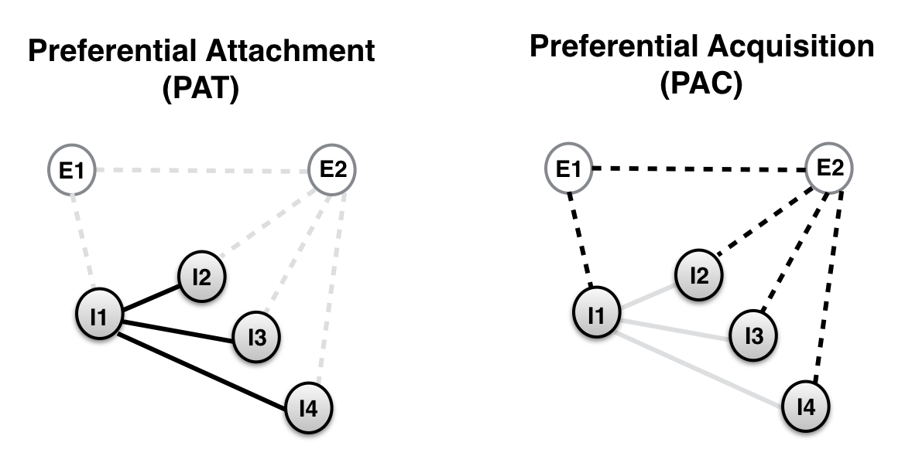

```{r}
knitr::opts_chunk$set(echo=F, warning=F, cache=F, message=F, sanitize = T)
```


```{r load_packages, include = FALSE}
library(papaja)
library(readr)
library(tidyr)
library(ggplot2)
library(cowplot)
library(knitr)
library(boot)
library(dplyr)
library(langcog)
library(ggthemes)
library(broom)
library(HDInterval)
#library("knitcitations")
#cleanbib()
#options("citation_format" = "pandoc")
```

#Introduction

What factors shape vocabulary learning over the course of early childhood? To investigate this question, scientists have adopted multiple research strategies, from conducting controlled laboratory experiments [e.g. @markman90] to analyzing dense corpora capturing language learning in context [e.g., @roy2015]. One strategy consists in documenting the timeline of words' acquisition, and studying the properties that make words easy or hard to learn. For example, within a lexical category, words that are more frequent in child-directed speech are acquired earlier [@goodman2008]. Other factors include word length, the mean length of utterances in which the word occurs, and concreteness [see @braginsky2016]. 

Besides these word-level properties, the lexical structure (that is, how words relate to each other) also influences the age of acquisition of words.  The lexical structure can be characterized in terms of a network where each node represents a word in the vocabulary, and each link between two nodes represents a relationship between the corresponding pair of words (e.g., Collins and Loftus, 1975). Previous studies have investigated early vocabulary structure by constructing networks using  a variety of word-word relations including shared semantic features, target-cue relationships in free association norms, co-occurrence in child directed speech, and phonological similarity. These studies have found that children tend to produce words that have higher neighborhood density (i.e., high connectivity in the network) earlier, both at the phonological and the semantic level [@storkel2009; @hills2009; @hills2010; @engelthaler2017; @stella2017] add Beckage, 2011 and other people... 

While most studies have focused on the static properties of the lexical network, a few have investigated the underlying developmental process. In particular, @steyvers2005 suggested that the observed effects of connectivity are the consequence of how the lexical network gets constructed in the child's mind. According to this explanation, known as Preferential Attachment, highly connected words in the child's lexicon tend to "attract" more words over time, in a rich-get-richer scenario [@barabasi99]. In other words, what predicts word learning is the *internal* connectivity in the child's early lexicon.  In contrast, @hills2009 suggested that what biases the learning is not the connectivity in the child's internal lexicon but, rather, *external* connectivity in the learning environment. They called this alternative explanation Preferential Acquisition. For clarity of reading, we will call preferential attachment the Internally-driven mechanism (INT), and preferential acquisition the Externally-driven mechanism (EXT). Figure\ \@ref(fig:growth) shows an illustration of both growth scenarios with the same simplified network. These two proposals represent two divergent ideas about the role of lexical networks in acquisition. On the INT proposal, network structure is a causal factor in early word learning; in contrast, on the EXT approach, network structure is not internally represented and, therefore, might be an epiphenomenon of the statistics of the linguistic input.

```{r growth, fig.cap = "Illustration of the two growth scenarios. Filled circles (I1-I4) represent known words (Internal), and empty circles (E1 and E2) represent words that have not been learned yet (External). Black lines represent links that are relevant in each growth scenario, and gray lines represent links that are irrelevant. For INT, the utility of a candidate, external node is the average degree (i.e., number of links) of the internal nodes that it would attach to. Thus, according to INT, the node E1 is more likely to enter the lexicon first. For EXT, the utility of a candidate node is its degree in the entire network. According to EXT, the node E2 is more likely to enter the lexicon first.", fig.align = "center", out.width = "400px"}

```

@hills2009 found that early lexical networks do not grow through INT as was originally hypothesised by @steyvers2005, but rather through EXT. This finding, though potentially very profound, has only been estabished in the special case of networks that are based on 1) semantic associations,  2) word production as a measure of acquisition, and 2) data from English-learning children, only. The extent to which this result depends on the domain, the measure and culture/languagae is still unclear. In this work, we test the generality of the finding along these three dimesnions.

First, we study the phonological network in addition to the semantic network. These two networks represent different ways the mental lexicon is strcutured. In particular, words that are neighbors in the semantic network (e.g., "cat", "dog") are not necessarily neighbors in the phonological network, and vice versa. Does the phonological network also influence word learning? Previous work did find an effect of words' connectivity in the phonological network on their age of learning (Storkel, 2004, 2009; Stokes 2014). In other words, words learned earlier in life tend to sound similar to many other words than a word learned later in life. However, as mentioned above, this finding did not examine the underlying learning mechanism.\footnote{In particular, this finding is compatible with both INT and EXT.} Here, we investigate whether phonological networks, like semantic networks, grow through EXT, or if they rather grow via INT (Figure\ \@ref(fig:growth)).
<!--
The phonological strcuture influence word processing in adults (Vitevitch, 2008;  Chan & Vitevitch, 2009; Chan & Vitevitch,2010; Vitevitch, Chan, and Roodenrys, 2012; Castro et al. 2018). Here we test whether the mechanism of networtk growth in the phonological domains mirrors the mechanism found in the semantic domains. -->

Second, we study vocabularies measured using both comprehension and production. Previous studies have found differences between these vocabularies in terms of their content and rate of acquistion (Benedict, 1979; Fensen et al. 1993). These differences can be due to the fact that comprehension and production do not share the same contraints. For instance, whereas comprehension depends on the ease with which words are stored and accessed, production depends additionally on the ease with witch words are articuated (e.g., shorter words are produced earlier, Braginsky et al. 2016). By including comprehension-based vocabularies in our analysis, we assess the extent to which the network growth mechanisms capture general learning patterns beyond the specific constraints of production. 

Finally, we use developmental data in 10 languages. Lexical networks can show more or less cross-lingustic variability along both the semantic and phonological domains (Youn et al. 2015; Arbesman et al. 2009).\footnote{The difference is more obvious in the phonolgical case where the network strcuture––and the distribution of word connectivity––can a priori change from language to language depending on various languisitc conventions.} Besides, cultures might differ in the way caregivers guide the chidlren's learning patterns or in the way the adults' linguistic input is organized (Kuhl et al., 1997; Cristia et al. 2017), and this difference could influecne the learning mechanism. Thus, Cross-linguistic comparison is crucial to test what mechanism is cognitively universal and is used by all children, and what mechansism is specific to some patterns of learning that emerge due to the particulars of a given language or culture (Bates & MacWhinney, 1987; Slobin, 1985). 

HERE ORGANIZATION OF THE PAPER

# Networks

## Data

We used data from Wordbank [@frank2017], an open repository aggregating cross-linguistic language developmental data of the MacArthur-Bates Communicative Development Inventory (CDI), a parent report vocabulary checklist. Parent report is a reliable and valid measure of children's vocabulary that allows for the cost-effective collection of datasets large enough to test network-based models of acquisition [@fenson94]. When filling out a CDI form, caregivers are either invited to indicate whether their child “understands” (comprehension) or “understands and says” (production) for each of about 400 words. For youner chidlren (between 8 and 18 months), both comprehension and production are queried, whereas for oder chidlren (between 16 to 36 months) only production is queried. We use data from younger chidlren to test comprehension and data from older chidlren to test production. Following previous studies [@storkel2009; @hills2009], we restrict our analysis to nouns. Table \@ref(tab:stats) gives an overview of the data source.

## Age of acquisition
For each word in CDI data, we compute the proportion of children who understand or produce the word at each month. Then we fit a logistic curve to these proportions and determined when the curve crosses 0.5, i.e., the age at which at lest 50% of chidlren know the word. We take this point in time to be each word’s age of acquisition [@goodman2008] and Braginsky.

<!--We obtained these nouns in ten languages: Croatian, Danish, English, French, Italian, Norwegian, Russian, Spanish, Swedish, and Turkish. We used the subset of nouns that had entries in the Florida Association Norms (see below). Since these norms are available only in English, we used the hand-checked translation equivalents provided by @braginsky2016, allowing us to use the English association norms across languages. Table \@ref(tab:stats) gives an overview of the data used. --> 


```{r stats, results="asis", echo=FALSE}

statistics <- feather::read_feather("../saved_data/statistics.feather") 
rownames(statistics) <- NULL 

tab <- xtable::xtable(statistics,
                      caption = "\\label{tab:stats}Total number of nouns produced by toddlers in the CDI (left). We included in our study the subset of these nouns that had available English translations (middle). The final set consisted of nouns that had both available translations as well entries in the Free Association Norms (right).")

print(tab, type="latex", comment = F, table.placement = "H")

#print(statistics, type="latex", comment = F, table.placement = "H")
```


## Semantic networks

We constructed semantic networks for English data following the procedure outlined in @hills2009. We used as an index of semantic relatedness the Florida Free Association Norms [@nelson1998]. This dataset was collected by giving adult participants a word (the cue), and asking them to write the first word that comes to mind (the target). For example, when given the word "ball", they might answer with the word "game". A pair of nodes were connected by a directed link from the cue to the target if there was a cue-target relationship between these nodes in the association norms. The connectivity of a given node was characterized by its *indegree*: the number of links for which the word was the target. To model growth from month to month, we constructed a different network at each month, based on the words that have been acquired by that month.  

Free Association norms are available only in English. We used the hand-checked translation equivalents available in Wordbank, which allowed us to use the English association norms across languages. Note that this does not necessarily mean that the resulting networks will be the same across languages, or that these networks will grow similarly. Though using the same association data acoss langauges assumes that the semantic similarity measure is universal (which is a reasonable approximation, Youn et al. 2015), the set of words acquired by children as well as the timeline of this acquisition can still vary from language to language leading to possbility different learing strategies.


## Phonological networks

To construct phonological networks we first mapped the orthogrphic transcrition of words to their International Phonetic Alphabet (IPA) transcriptions, across languages, using the open source text-to-speech software **[Espeak](http://http://espeak.sourceforge.net/).** We used the Levenshtein distance (also known as edit distance) as a measure of phonological relatedness between two nodes. The measure counts the minimum number of operations (insertions, deletions, substitutions) required to change one string into another.  

In previous studies, two nodes were linked if they had an edit distance of 1 [e.g., @storkel2009]. However, in these previous studies the network was built using an adult vocabulary. In the current study, however, network growth models are based on the children's early vocabulary which contains very few word pairs with an edit distance of 1. When using this threshold, the resulting networks were too sparse and uninformative. Thus, we increased the threshold from 1 to 2, that is, two nodes were related if their edit distance was equal to 1 or 2. The connectivity of a given node was characterized with its *degree*: the number of links it shares with other words.  

# Analysis

## Static properties of the global network

We start by analyzing word connectivity in the global (static) network. We constructed this network using nouns learned by the oldest age for which we have CDI data (e.g., in English this corresponds, in comprehension, to the network by 18 months, and in production, to the network by 30 months). This global network is the end-state towards which both INT and EXT converge by the last month of learning. Moreover, following @hills2009, we used this end-state network as a proxy for the external connectivity in the learning environment. Below we analyze properties of this global networks that are relevant to INT and/or EXT. 


```{r}
#Import data from saved
data_all <- feather::read_feather("../saved_data/data_static_scaled.feather")

data_long <- data_all %>%
  rename(Sem = sem_deg, Phono=phono_deg) %>%
  gather(predictor, value, Sem:frequency) %>%
  dplyr::filter(predictor == "Sem" | predictor == "Phono") 

correlations <- data_long %>%
  group_by(measure, language, predictor) %>%
  summarise(cor = round(cor(aoa, value), 2))

plot_correlation_prod <- ggplot(subset(data_long, measure == "produces"), aes(x=value, y=aoa))+
  facet_grid(predictor ~ language)+#, scales = "free") +
  geom_jitter(#aes(colour = lexical_class),
    colour = solarized_palette(1),
    size = 0.5, alpha = 0.5) +
  geom_abline(slope = -1)+
  coord_cartesian(xlim=c(-1,5))+
  #scale_x_continuous(limits=c(-2,5))+
  scale_y_continuous(breaks =c(15,25,35))+
  geom_smooth(method = "lm", colour = "grey3", se=FALSE)+
  scale_colour_solarized(name = "") +
  theme_few()+
  #theme_bw()+
  theme(aspect.ratio = 0.7, 
        plot.margin=grid::unit(c(0,0,0,0), "mm")
        )+
  geom_text(data=subset(correlations, measure=="produces"), aes(label=paste("r=", cor, sep="")), x=3.5, y=33, size=2, fontface = "bold")+
  xlab("degree z-score") +ylab("Age")


plot_correlation_comp <- ggplot(subset(data_long, measure == "understands" & aoa < 35), aes(x=value, y=aoa))+
  facet_grid(predictor ~ language)+#, scales = "free") +
  geom_jitter(#aes(colour = lexical_class),
    colour = solarized_palette(1),
    size = 0.5, alpha = 0.5) +
  geom_abline(slope = -1)+
  coord_cartesian(xlim=c(-1,5))+
  #scale_x_continuous(limits=c(-2,5))+
  scale_y_continuous(breaks =c(15,25,35))+
  geom_smooth(method = "lm", colour = "grey3", se=FALSE)+
  scale_colour_solarized(name = "") +
  theme_few()+
  #theme_bw()+
  theme(aspect.ratio = 0.7, 
        plot.margin=grid::unit(c(0,0,0,0), "mm")
        )+
  geom_text(data=subset(correlations, measure=="understands"), aes(label=paste("r=", cor, sep="")), x=3.5, y=25, size=2, fontface = "bold")+
  xlab("degree z-score") +ylab("Age")

#ggsave("figs/plot_correlation_prod.pdf", plot = plot_correlation_prod, width = 10, height = 3)
#ggsave("figs/plot_correlation_comp.pdf", plot = plot_correlation_comp, width = 10, height = 3)
```


```{r corrAll, out.width = "\\textwidth", fig.pos = "!h", fig.cap = "Age of production (A) and comprehension (B) in the global network as predicted by the degree in this network. Results are shown in each language for phonological and semantic networks. Each point is a word, with lines indicating linear model fits."}

plot_grid(plot_correlation_prod , NULL, plot_correlation_comp , labels = c("A", "", "B"), ncol = 1, align = "v", rel_heights = c(1.3, 0.1, 1.3))

```


###Connectivity predicts the age of acquisition

Connectivity in the global network is directly related to EXT as it represents the explicit criterion this growth scenario uses to determine what words should be learned first (Figure \@ref(fig:growth)). Therefore, a direct consequence of a EXT-like growth scenario is a correlation between connectivity in the global network and the age of acquisition.\footnote{This correlation is also compatible with INT, although the causality is reversed. Indeed, from the perspective of this growth scenario, higher connectivity in the global network is caused by earlier learning, not the other way around. Some words end up being highly connected in the global network precisely because they happen to be acquired earlier and, therefore, have a higher chance of accumulating more links over time.} Figure \@ref(fig:corrAll) shows how the age of production (A) and comprehension (B) for each word varies as a function of its degree (or indegree for the semantic networks). For ease of visual comparison, the predictor (i.e., the degree) was centered and scaled across languages. The plots show, overall, a negative correlation between the month of acquisition and the degree, indicating that nouns with higher degrees are generally learned earlier. HERE MENTION THE AVERAGE VALUE OF THE CORRELATIONS

```{r}

degree_dist <- feather::read_feather("../saved_data/degree_dist.feather") %>%
  mutate(data=ifelse(measure=='produces', 'Prod.', 'Comp.'))

plot_degree <- ggplot(data = degree_dist,  aes(x=x, y=y, col=dimension))+
  facet_grid(data ~ language)+#, scales = "free") +
  geom_point(#aes(colour = lexical_class),
    #colour = solarized_palette(1),
    size = 0.5, alpha = 0.5) +
  scale_y_log10() + scale_x_log10() +
  theme(aspect.ratio = 1) +
  theme_few()+
  theme(aspect.ratio = 0.7)+
  xlab("Degree") +ylab("Prob.")

ggsave("figs/plot_degree.pdf", plot = plot_degree, width = 10, height = 3)
```

```{r degreeDist, out.width = "\\textwidth", fig.pos = "!h", fig.cap = "Log-log plot of the cumulative degree distribution function for the global phonological and semantic networks across languages. The figure shows the results for both production and comprehension data. A perfect power-law distribution should appear as a straight line in this graph."}

knitr::include_graphics("figs/plot_degree.pdf")

```

###Power-law degree distribution

We also analyzed the global network's degree distribution. The shape of this distribution is particularly relevant to INT as this growth scenario is known to generate networks with a power-law degree distribution [i.e., a distribution of the form $p(k) \propto \frac{1}{k^{\alpha}}$, @barabasi99]. If the network displays this property, this fact would suggest a INT-like generative process. Conversely, if the degree distribution does not follow a power law, this fact would weaken the case for INT. The log-log plots are shown in Figure \@ref(fig:degreeDist). We fit a power law to each empirical degree distribution following the procedure outlined in @clauset09 and using the related R package [poweRlaw, @gillespie15]. 

In brief, the analysis consisted in two steps. First, we derived the optimal cut-off, $k_{min}$, above which the distribution is more likely to follow a power law,\footnote{In natural phenomena, it is often the case that the power law applies only for values above a certain minimum.} and we estimate the corresponding scaling parameter $\alpha$. Second we calculated the goodness-to-fit, which resulted in a $p$-value quantifying the plausibility of the model. 

The results are shown in table XX. Overall, we could not reject the null hypothesis of a power-law distribution: the $p$-value was generally above 0.1. Also talk about the fact that the power law is truncated.

In sum, the static properties of the global network are *a priori* compatible with both INT and EXT. In order to decide between these two developmental scenarios, we need to fit explicit growth models to the data.

<!--

```{r}

growth_preds <- feather::read_feather("../saved_data/growth_preds.feather")

plot_growth_preds_prod <- ggplot(subset(growth_preds, measure == "produces" & Test=='Individual'), aes(x = model , y = mean)) +
  #geom_pointrange(aes(ymin = hdi_lower, ymax = hdi_upper, col = model, linetype=Test),
  geom_pointrange(aes(ymin = hdi_lower, ymax = hdi_upper, col = model),
                  position = position_dodge(width = .5),
                  size = 0.5,
                  fatten = 0.5)+
  geom_hline(yintercept = 0, color = "grey", linetype = "dashed")+
  coord_flip() +
  facet_wrap( ~ language, ncol=5) +
  guides(colour=FALSE, linetype = guide_legend(override.aes = list(size=0.3)))+
  scale_colour_solarized() +
  theme_few()+
  theme(aspect.ratio = 0.7) + #,+
        #axis.text.x = element_text(size=7.5, angle=45)) +
  scale_y_continuous(breaks =c(0,0.2))
  #scale_y_discrete(breaks =NULL)


plot_growth_preds_comp <- ggplot(subset(growth_preds, measure == "understands" & Test=='Individual'), aes(x = model , y = mean)) +
  #geom_pointrange(aes(ymin = hdi_lower, ymax = hdi_upper, col = model, linetype=Test),
  geom_pointrange(aes(ymin = hdi_lower, ymax = hdi_upper, col = model),
                  position = position_dodge(width = .5),
                  size = 0.5,
                  fatten = 0.5)+
  geom_hline(yintercept = 0, color = "grey", linetype = "dashed")+
  coord_flip() +
  facet_wrap( ~ language, ncol=5) +
  guides(colour=FALSE, linetype = guide_legend(override.aes = list(size=0.3)))+
  scale_colour_solarized() +
  theme_few()+
  theme(aspect.ratio = 0.7) +
  scale_y_continuous(breaks =c(0,0.2))


#ggsave("figs/plot_growth_preds_prod.pdf", plot = plot_growth_preds_prod, width = 10, height = 4)
#ggsave("figs/plot_growth_preds_comp.pdf", plot = plot_growth_preds_comp, width = 10, height = 4)


```

-->

```{r}
##Test
growth_preds <- feather::read_feather("../saved_data/growth_preds.feather")

growth_preds$model <- plyr::mapvalues(growth_preds$model, 
                                 from = c("semPAC","semPAT","phonoPAC", "phonoPAT"), 
                                 to = c("semEXT","semINT","phonoEXT", "phonoINT"))

growth_preds$measure <- plyr::mapvalues(growth_preds$measure, 
                                 from = c("produces","understands"), 
                                 to = c("production","comprehension"))

plot_growth_preds <- ggplot(subset(growth_preds, Test=='Individual'), aes(x = model , y = mean)) +
  geom_pointrange(aes(ymin = hdi_lower, ymax = hdi_upper, col = model, linetype=measure),
  #geom_pointrange(aes(ymin = hdi_lower, ymax = hdi_upper, col = model),
                  position = position_dodge(width = .5),
                  size = 0.5,
                  fatten = 0.5)+
  geom_hline(yintercept = 0, color = "grey", linetype = "dashed")+
  coord_flip() +
  facet_wrap( ~ language, ncol=5) +
  guides(colour=FALSE, linetype = guide_legend(override.aes = list(size=0.3)))+
  scale_colour_solarized() +
  theme_few()+
  theme(aspect.ratio = 0.7) + #,+
        #axis.text.x = element_text(size=7.5, angle=45)) +
  scale_y_continuous(breaks =c(0,0.2))  +
  #scale_y_discrete(breaks =NULL)
  ylab("Estimate") +xlab("Mechanism")


#plot_growth_preds
```


```{r growthPred, out.width = "\\textwidth", fig.pos = "!h", fig.cap = "Evaluation of growth scenarios (EXT: externally-driven, INT: internally-driven) for both semantic and phonological networks. Each point represents the mean of the posterior distribution of the growth parameter, with ranges representing 95\\% credible intervals. Positive values mean that learning proceeds according to the predictions of the growth scenario, whereas negative values mean that learning proceeds in opposition to the predictions of the growth scenario."}

#legend <- get_legend(plot_growth_preds_prod)

#plot_noLegend <- plot_grid(plot_growth_preds_prod + theme(legend.position="none"), NULL, plot_growth_preds_comp + theme(legend.position="none"), labels = c("A", "", "B"), ncol = 1, align = "v", rel_heights = c(1.3, 0.1, 1.3))

#plot_grid(plot_noLegend, legend, rel_widths = c(2, .2))


#plot_noLegend <- plot_grid(plot_growth_preds_prod, NULL, plot_growth_preds_comp , labels = c("A", "", "B"), ncol = 1, align = "v", rel_heights = c(1.3, 0.1, 1.3))

#plot_grid(plot_noLegend)

#knitr::include_graphics("figs/plot_growth_preds_prod.pdf")

plot_growth_preds

```

## Network growth models

### How does each growth scenario predict noun development?

To test the network growth scenarios, we fit different growth models to the data. We calculated the probability that a word $w_i$, with a growth value $d_i$ would enter the lexicon at a given month, using a softmax function: 
\begin{equation}
 p(w_i)= \frac{e^{\beta d_i}}{\sum_j e^{\beta d_j} }
\end{equation}

\noindent where $\beta$ is a fitted parameter that captures the magnitude of the relationship between network parameters and growth (analogous to a regression coefficient). A positive value of $\beta$ means that words with higher growth values $d_i$ are acquired first, and a negative value means that words with lower growth values are acquired first (see Figure \@ref(fig:growth) for an illustration of how growth values $d_i$ are defined in each growth scenario). The normalization includes all words that could be learned at that month.  

We estimated the parameter $\beta$ using a Bayesian approach. The inference was performed using the probabilistic programming language  WebPPL [@dippl]. We defined a uniform prior over $\beta$, and at each month, we computed the likelihood function over words that could possibly enter the lexicon at that month, fit to the words that have been learned at that month (using formula 1). Markov Chain Monte Carlo sampling resulted in a posterior distribution over $\beta$, which we summarized in Figure \@ref(fig:growthPred).

The results replicate Hills et al.'s finding regarding the semantic netowrk in English and prouction data, which is that this network grows by EXT, not by INT. Besides, this finding generalize to comprehension, and holds overall across languages. One could imagine that the fact of using English free association norms cross-linguistically would decrease the effect of non-English semantic networks because of possible cultural differences. However, our findings do not support this assumption, rather it supports our intial approximation, albeit a posteriori, about the unversisality of the semantic similarity measure. In the phonological domain, the EXT model also fits better the data than INT for both production and comprehension. Similar to the sematic domain, the findings generalize well cross-linguistically.

```{r}
##Test
static_preds <- feather::read_feather("../saved_data/static_preds.feather")

static_preds$predictor <- plyr::mapvalues(static_preds$predictor, 
                                 from = c("sem_deg","phono_deg","frequency", "length"), 
                                 to = c("semEXT","phonoEXT", "frequency", "length"))

static_preds$measure <- plyr::mapvalues(static_preds$measure, 
                                 from = c("produces","understands"), 
                                 to = c("production","comprehension"))

plot_static_preds <- ggplot(subset(static_preds, Test=='Combined'), aes(x = predictor , y = estimate)) +
  geom_pointrange(aes(ymin = X2.5.., ymax = X97.5.., col = predictor, linetype=measure),
  #geom_pointrange(aes(ymin = hdi_lower, ymax = hdi_upper, col = model),
                  position = position_dodge(width = .5),
                  size = 0.5,
                  fatten = 0.5)+
  geom_hline(yintercept = 0, color = "grey", linetype = "dashed")+
  coord_flip() +
  facet_wrap( ~ language, ncol=5) +
  guides(colour=FALSE, linetype = guide_legend(override.aes = list(size=0.3)))+
  scale_colour_solarized() +
  theme_few()+
  theme(aspect.ratio = 0.7) + #,+
        #axis.text.x = element_text(size=7.5, angle=45)) +
  scale_y_continuous(breaks =c(0,0.2))  +
  #scale_y_discrete(breaks =NULL)
  ylab("Estimate") +xlab("Mechanism")


```
<!--
```{r}
static_preds <- feather::read_feather("../saved_data/static_preds.feather")

plot_static_preds_prod <- ggplot(subset(static_preds, measure =="produces" & Test =="Combined"), aes(x = predictor, y = estimate)) +
  #geom_pointrange(aes(ymin = X2.5.., ymax = X97.5.., y = estimate, col = predictor, linetype=Test), 
  geom_pointrange(aes(ymin = X2.5.., ymax = X97.5.., y = estimate, col = predictor),
                  position = position_dodge(width = .5),
                  size = 0.5,
                  fatten = 0.5)+
  geom_hline(yintercept = 0, color = "grey", linetype = "dashed")+
  facet_wrap(~language, ncol=5)  +
  coord_flip() +
  guides(colour=FALSE)+
  scale_colour_solarized() +
  theme_few()+
  theme(aspect.ratio = 0.7)

plot_static_preds_comp <- ggplot(subset(static_preds, measure =="understands" & Test =="Combined"), aes(x = predictor, y = estimate)) +
  #geom_pointrange(aes(ymin = X2.5.., ymax = X97.5.., y = estimate, col = predictor, linetype=Test),
  geom_pointrange(aes(ymin = X2.5.., ymax = X97.5.., y = estimate, col = predictor),
                  position = position_dodge(width = .5),
                  size = 0.5,
                  fatten = 0.5)+
  geom_hline(yintercept = 0, color = "grey", linetype = "dashed")+
  facet_wrap(~language, ncol=5)  +
  coord_flip() +
  guides(colour=FALSE)+
  scale_colour_solarized() +
  theme_few()+
  theme(aspect.ratio = 0.7)

```
-->

```{r staticPred, out.width = "\\textwidth", fig.pos = "!h", fig.cap = "Estimates of the relative contribution of each predictor of AoA in the combined regression model. Results are shown for both production and comprehension data. Ranges indicate 95\\% confidence intervals. Positive values indicate a positive relationship (e.g. longer words tend to have a higher AoA), while negative values indicate a negative relationship (e.g. words with higher frequency tend to have a lower AoA)."}

#legend <- get_legend(plot_static_preds_prod)

#plot_noLegend <- plot_grid(plot_static_preds_prod + theme(legend.position="none"), NULL, plot_static_preds_comp + theme(legend.position="none"), labels = c("A", "", "B"), ncol = 1, align = "v", rel_heights = c(1.3, 0.1, 1.3))

#plot_grid(plot_noLegend, legend, rel_widths = c(2, .2))


#plot_noLegend <- plot_grid(plot_static_preds_prod, NULL, plot_static_preds_comp , labels = c("A", "", "B"), ncol = 1, align = "v", rel_heights = c(1.3, 0.1, 1.3))

#plot_grid(plot_noLegend)

plot_static_preds

```

<!--
### What is the relative contribution of each growth model?

Above we evaluated the network growth scenarios individually. As a next step, we analyzed their relative contribution to the learning process. This was done through adding more fitted parameters to the model, that is, by substituting $\beta d_i$ in formula (1) with: $$\beta_{1} d_{i, 1} + \beta_{2} d_{i, 2} + \beta_{3} d_{i, 3} + \beta_{4} d_{i, 4}$$ where the indices represent the 4 networks: semPAT, semPAC, phonoPAT and PhonoPAC. Using the same fitting technique, we obtained the values shown in Figure \ref{fig:pred_ind}. PAC dominates the learning. Both phonological and semantic networks contribute to lexical growth, but the phonological network appears to be stronger and more consistent across languages. In summary, the findings show that both semantic and phonological networks contribute to the learning process, and that they both grow primarily by PAC, relying on the external connectivity in the learning environment, rather than the internal connectivity in the acquired lexicon.

-->

```{r}
static_preds_all <- feather::read_feather("../saved_data/static_preds_all.feather")


static_preds_all$predictor <- plyr::mapvalues(static_preds_all$predictor, 
                                 from = c("sem_deg","phono_deg","frequency", "length"), 
                                 to = c("semEXT","phonoEXT","frequency", "length"))

plot_static_preds_all <- ggplot(static_preds_all, aes(x = predictor, y = Estimate)) +
  geom_pointrange(aes(ymin = X2.5.., ymax = X97.5.., y = Estimate, col = predictor, linetype=Test),
                  position = position_dodge(width = .5),
                  size = 0.5,
                  fatten = 0.5)+
  geom_hline(yintercept = 0, color = "grey", linetype = "dashed")+
  facet_wrap(~measure)  +
  coord_flip() +
  guides(colour=FALSE)+
  scale_colour_solarized() +
  theme_few()+
  theme(aspect.ratio = 0.7)

ggsave("figs/plot_static_preds_all.pdf", plot = plot_static_preds_all, width = 6, height = 3)

```

```{r staticAll, out.width = "\\textwidth", fig.pos = "!h", fig.cap = "Estimates of the relative contribution of each predictor of AoA in the combined mixed-effects model with language as a random effect. Results are shown for both production and comprehension data. Ranges indicate 95\\% confidence intervals. Dotted ranges indicate the estimates for the predictor in a separate model that includes only this predictor as a fixed effect."}

knitr::include_graphics("figs/plot_static_preds_all.pdf")

```

## Comparison to other predictors of age of acquisition

We saw that the way semantic and phonological information is structured in the learning environment (i.e., EXT) contributes to noun learning across languages. However, we know that other factors influence learning as well [e.g., @braginsky2016]. Next we investigated how semantic and phonological connectivity interact with two other factors. The first one is word frequency, a well studied factor shown to predict the age of acquisition in a reliable fashion [e.g. @goodman2008]. The second factor is word length, which correlates with phonological connectivity: Shorter words are more likely to have higher connectivity (Pisoni et al., 1985; Vitevitch and Rodriguez, 2004), and thus it critical to test if phonological connectivity plays a role in learning above and beyond word length.   

Since the previous section showed that INT was uninformative, we dropped it from this analysis, keeping only EXT. This simplified the model because we no longer needed to fit growth month-by-month.The latter was a requirement only for INT where the words' utilities varied from month to month, depending on how connectivity changed in the growing internal network. A more direct way to assess and compare the contribution of EXT in relation to other word-level factors is through conducting linear regressions, where connectivity in the learning environment, frequency and length predict the age of acquisition.

For word length, we counted the number of phonemes in our generated IPA transcription. For word frequency, we used the frequency estimates from @braginsky2016 where unigram counts were derived based on CHILDES corpora in each language (MacWhinney, 2000). For each word, counts included words that shared the same stem  (e.g., "cats" counts as "cat"), or words that were synonymous (e.g. "father" counts as "daddy"). Note that these frequency counts are based on transcripts from independent sets of children and represent a general estimate of environmental frequency across children. The use of an independent dataset is warraned because it uses large samples to average out the difference between children (see Goodman et al. 2008). 

We conducted two analyses. We fit a linear regression for each language, and we fit a linear mixed-effect model to all the data pooled across languages, with language as a random effect. Figure \@ref(fig:staticPred) shows the coefficient estimate for each predictor in each language for production and comprehension data. Figure \@ref(fig:staticAll) shows the coefficient estimates for all languages combined (all predictors were centered and scaled). 

The findings for the new predictors were as follows. Overall, frequency is the largest and most consistent predictor of age of acquisition in both comprehension and production data and across languages, endorsing results for nouns across a variety of analyses [@goodman2008; @braginsky2016; @roy2015]. Word length is more predictive for production than comprehension (and this difference is very clear in the global model), replicating previous work (Braginsky et al., under review). Thus, word length seems to reflect the effects of production constraints rather than than comprehension constraints (i.e., long words are harder to pronounce than short words, but maybe not more difficult to store or access). 

As for the factors of interest, i.e., semantic and phonological connectivity, we found cross-linguistic differences. Phonological connectivity contributes to learning in some languages but not in other. In particular, semantic connectivity does not explain variance in English data beyond that explained by phonological connectivity, frequency and length. This contrasts with the original finding in @hills2009. However, in this previous study, semantic connectivity was not tested in a model that included frequency, length and phonological connectivity as covariates. Another important difference is the number of words tested: Our study uses a larger set of nouns. That said, and despite these cross-linguistic differences, both phonological and semantic connectivity are significant predictors in the combined model. 


# Discussion

This study provided an analysis of network growth during development. We compared the two major network growth scenarios desribed in the pioneering work of @hills2009.  The first scenario, INT (orignially called Preferentailly Attachement), described a rich-get-richer network growth model in which the current structure of the learner's internal network determines future growth; the other, EXT (orignially called Preferentailly Acquisition) described a model in which the external, global environmental network structure determines learners' growth patterns. Previous word in this line of research (e.g., @hills2009; @hills2010; Sailor 2013) has been limited in its scope: It focused on semantic networks, while relying only on words' production as a mesure of their acquisition, and using almost exclusively developmental data from English-learning children. This study test the generality previous findings first by investigting phonological networks together with semantic networks, second by adopting both production and comprehension as measures of learing, and crucially, by comparing the findings across 10 languages.

We found that the orginal findings reported in @hills2009 generalize well across all these dimensions. First, just like semantic networks, phonological networks grow via the externally-driven scenrio (EXT), not by the internally-driven mechanism (INT). Besides, both semantic and phonological networks contribute to the learning process above and beyond other known predcitors of word learning such as frequency and word length. Second, comprehension-based vocabularies grow in a way similar to production-based vocabularies [HERE ADD MORE NUANCE?]. Finally, the findings were overall similar across the 10 languages we tested. Although we find some cross-lingusitic variation when semantic and phonological networks were pitted against frequency and length, this variability is to be taken with a grain of salt as it might be exaggerated in our study by the limited and partially-overlapping sample of nouns for each language. In fact, both phonological and semantic connectivity are significant predictors when data are pooled across languages.

These findings corroborate the hypothesis that children start by learning words that have high similarity to a variety of other words in the learning environment, not in the child's available lexicon. This means, strikingly, that children are sensitive to highly connected words although they do not initially have access to the full network. This remarks begs the following question: What mechanism could allow children to tease apart highly connected words from low connected words? Besides, why would highly connected words be easier to learn? 

One possbility is that children rely on their statistical learning abilities. For example, in the semantic domain, children might be using a mechanism akin to cross-situational learning to pick up the meanings of some words, especially concrete nouns [@smith2008], and such learning would resemble the growth scenario described by EXT.  Indeed, since free association is related to contextual co-occurrence (Griffiths et al., Fourtassi and Dupoux, 2013), highly connected words will tend to occur in a variety of speech and referential contexts.  This fact makes such a word easier to learn  only because it has more referential disambiguating cues across learning contexts, and crucially, even without knowing the entire set of words with witch it occurs (hence the similarity with EXT). This possibility is supported by the finding that nouns' diverstiy of occurrence in child directed speech predicts their age of learing (@hills2010).

In the phonological case, network growth according to EXT is also compatible with a scenario whereby children are tracking lwo level statistical patterns, e.g., high probability sound sequences. Indeed, connectivity in the phonological network is inherently correlated with phonotactic probability [@vitevitch1999]. That is, highly connected words tend to be made of frequent sound sequences. Children are sensitive to local phonotactic regularities [@jusczyk1994] and this sensitivity might lead them to learn higher-probability words more easily [e.g., @storkel2001]. This explanation is supported by computational simualtions that shows how learning general phonotactics patterns create ``well-worn paths'' which allow for the representation of several distinct but phonologically neighboring words (Dell et al; 1993; Tavac et al. 2017).

Besides using their own statitistical learning skills, children could also benefit from the the way their caregivers speak. Perhaps the cargivers put more emphasis on the words that are highly connected in _their_ mature lexical network. This emphasis would guide children to learn first these highly connected words even though children do not have access to the distribution of words' connectivity in the final network.  Investigting this possibility would require further research on caregiver-child interaction (MacWhinney, 2014; Roy et al. 2015), examining what words are introduced over development and the extent to which children's uptake is infuence by this input (Clark 2007;  Hoff and Naigles, 2002; Hurtado et al., 2008).

This work shares a number of limitations with previous studies using similar research strategy and datasets (e.g., Hills et al. 2009; 2010). Chief among these limitations is the fact that the age of word acquisition is computed using different children at different ages (due to the fact that avialable CDI data is mainly cross-sectional). Althoug this measure has proven highly consistent (Fensen et al. 1993), it lead us to focus on studying the learning mechanism of the "average" child. Individual trajectories, however, could show different learning patterns. For example, using longitudinal data @beckage2011 found differences between typical and late talkers in terms of the semantic network structure. Besides, although our study endorses the externally-driven account of network growth, this does not mean individual children never use some variant of the internally-driven mechanism. For instance, some children develop "islands of expertise", that is, well organized knowledge about a certain topic (e.g., birds or dinosaurs). This prior knowledge enables these children to learn new related words more easily (e.g., Chi and Koeske, 1983).   

To conclude, our work validates previous results in early network development, and suggests that the advantage of highly connected words words may emerge, at least in the early stages of word learning, from the operation of simpler mechanisms in both the semantic and phonological domains. One question for future experimental work is whether such correlational patterns of growth can be produced in controlled behavioral experiments.


<!--Finally, while validating previous results using network growth models, our study suggests that these correlational patterns may emerge from the operation of simpler mechanisms in both the semantic and phonological domains. One question for future experimental work is whether such patterns of growth can be produced in controlled behavioral experiments.
In particular, the results provide correlational but not causal evidence. Thus, the conclusions of this study  require parallel evidence, especially from controlled behavioral experiments.
-->


\vspace{1em} \fbox{\parbox[b][][c]{14cm}{\centering All data and code for these analyses are available at\ \url{https://github.com/afourtassi/networks}}} \vspace{1em}


# Acknowledgements
This work was supported by a post-doctoral grant from the Fyssen Foundation.


# Disclosure statement
None of the authors have any financial interest or a conflict of interest regarding this work and this submission.

# Appendix 1: Power law model

```{r powerLaw2, results="asis", echo=FALSE}

powerL <- feather::read_feather("../saved_data/degree_test.feather") %>%
  rename(Kmin = xMin) %>%
  rename(pValue = pVal)

powerProd <- powerL %>%
  dplyr::filter(measure == 'produces') %>%
  select(-measure)

powerComp <- powerL %>%
  dplyr::filter(measure == 'understands') %>%
  select(-measure)

#rownames(statistics) <- NULL 

tabProd <- xtable::xtable(powerProd,
                      caption = "Results of fitting a power law model to the degree distribution in each model for production data. Kmin is the optimal degree cut-off, alpha is the scaling parameter, and pValue is the probability that quantifies the plausibility of the power law hypothesis. If pValue is close to 1, the power law model cannot be rejected as a plausible fit for the data. If, instead, pValue is small (e.g., p < 0.05) then the null hypothesis of a power law model can be rejected.")

tabComp <- xtable::xtable(powerComp,
                      caption = "Results of fitting a power law model to the degree distribution in each model for comprehension data. Kmin is the optimal degree cut-off, alpha is the scaling parameter, and pValue is the probability that quantifies the plausibility of the power law hypothesis. If pValue is close to 1, the power law model cannot be rejected as a plausible fit for the data. If, instead, pValue is small (e.g., p < 0.05) then the null hypothesis of a power law model can be rejected.")

print(tabProd, type="latex", comment = F, table.placement = "H")
print(tabComp, type="latex", comment = F, table.placement = "H")
```


# References
```{r create_r-references}
r_refs(file = "references.bib")
```

\setlength{\parindent}{-0.5in}
\setlength{\leftskip}{0.5in}
